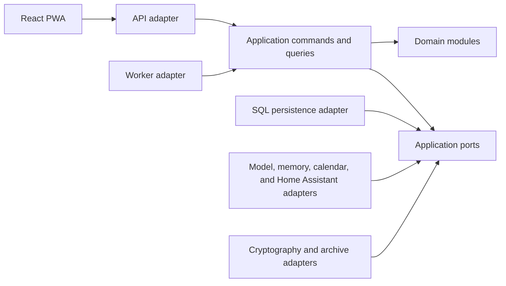
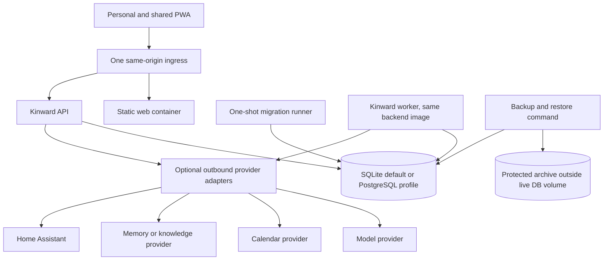

# Architecture Spine — Kinward

## Design Paradigm

`hexagonal-modular-monolith`

One deployable backend owns household state and policy. Domain modules and application ports are inward; API, persistence, worker, cryptography, and provider adapters depend on them. The React PWA is a separate client of versioned APIs.



## Invariants & Rules

### AD-01 — Local account authentication [DORMANT]

Superseded for the HA-native path: Kinward has no identity system of its own. People (including the
household administrator) sync from Home Assistant's own `person` entities, keyed on their stable HA
person registry id; a person's HA login toggling on/off changes only whether a `person` entity has a
linked `user_id`, never Kinward identity. This rule is dormant, not deleted - it becomes relevant again
only if a non-HA standalone client is ever built (Story 10.4, already gated behind a future PRD).

- **Binds:** FR-002, FR-005–FR-008, FR-028, FR-083, FR-085, FR-093, NFR-007
- **Prevents:** Replayable bearer credentials, unsafe profile rebinding, session survival after authority loss, and hidden external identity dependency.
- **Rule:** Local passwords use Argon2id-equivalent hashing. Opaque random sessions are stored server-side and sent only in `HttpOnly`, `Secure`, `SameSite` cookies. State-changing requests use explicit CSRF protection. Invitations and recovery capabilities are one-time, expiring, profile-bound, hashed at rest, and DB-revocable; recovery can restore only the same existing profile. Account state is exactly `active`, `disabled`, `locked`, or `recovery-pending`; `deletion-pending` is a separate overriding person lifecycle. Only `active` without that overlay has authority. Entry into a non-active state or deletion-pending atomically revokes security/authority artifacts, grants, providers, and proactivity; cancels unsubmitted work; and preserves submitted/`unknown` reconciliation blockers. Deletion-pending permits reconciliation only. Reactivation reauthenticates the same profile and revalidates all authority. External OIDC is unavailable.

### AD-02 — Versioned REST and SSE request contract [ADOPTED]

- **Binds:** FR-013–FR-017, NFR-018–NFR-019, NFR-029
- **Prevents:** Competing wire transports, hand-duplicated progress states, output after cancellation, and false terminal results.
- **Rule:** Commands and queries use REST JSON under `/api/v1`; ordered typed progress uses SSE with exactly one truthful terminal event. Every envelope and event is versioned. Cancellation is an application command and stops later model output and every unsubmitted mutation. WebSocket is not required.

### AD-03 — Provider-neutral assistant orchestration [ADOPTED]

- **Binds:** FR-013, FR-017, FR-021, FR-052, NFR-005–NFR-006, NFR-019, NFR-029
- **Prevents:** Model-provider coupling, prompt-selected authority, provider content bypassing policy, and loss of core use without a model.
- **Rule:** One versioned orchestration port accepts a minimal policy-filtered context bundle and emits typed events. Model adapters implement that port. Tools invoke only registered capabilities through application ports. Model and provider content is untrusted and cannot select identity, policy, authority, or mutation targets. A local no-provider path remains usable.

### AD-04 — Kinward-local topic and conversation authority [ADOPTED]

- **Binds:** FR-014–FR-027, FR-074–FR-086, NFR-010, NFR-029
- **Prevents:** Provider-only household state, split topic ownership, unbacked cross-surface continuity, and incomplete backup.
- **Rule:** Kinward SQL persistence is authoritative for topics, conversations, lifecycle, sharing, versions, surface provenance, and local memory references. Optional memory and knowledge stores are outbound projections and retrieval adapters, never the sole system of record.

### AD-05 — AccessContext before query and before serialization [ADOPTED]

- **Binds:** FR-018–FR-034, FR-039, FR-043–FR-044, FR-050–FR-054, NFR-001, NFR-003–NFR-006
- **Prevents:** Client-only filtering, provider overfetch, forbidden-field delivery, count or existence leakage, and protected content in denial records.
- **Rule:** Every application, repository, and provider port requires an `AccessContext`. Authorization and data-class policy run before repository/provider query construction and again before serialization. Clients never receive forbidden fields or existence signals. Denials append only sanitized security activity with opaque references.

### AD-06 — One local SQL authority with outbound provider ports [ADOPTED]

- **Binds:** all local state, FR-018–FR-021, FR-052–FR-086, NFR-010–NFR-016, NFR-029–NFR-030, NFR-034
- **Prevents:** Multiple systems of record, provider-native UI contracts, mandatory optional services, and datastore-specific domain behavior.
- **Rule:** Kinward SQL persistence owns household, accounts, assistants, topics/conversations, policies, actions/approvals, activity, cards/layouts, jobs/outbox, and backup metadata. SQLite 3 is required by default. PostgreSQL 17 is optional and cannot be advertised until the shared behavior and transaction suite passes on both. No Redis dependency is permitted. Provider adapters report capability, health, and freshness and return Kinward domain/view types only.

### AD-07 — Protected-data class and lineage [ADOPTED]

- **Binds:** FR-018–FR-026, FR-043, FR-082–FR-083, FR-090, FR-097–FR-098, NFR-001–NFR-006, NFR-030
- **Prevents:** Privilege laundering through summaries, stale derived disclosure, mixed-owner sharing, and source reclassification.
- **Rule:** Every protected item uses one metadata contract: owning principal type and UUID, canonical data class, item version, and versioned audience policy or grant reference. Default denial and deny-overrides apply; current policy/grant revocation invalidates access and downstream use. Every stored derived item additionally stores exact source IDs, source versions and classes, transformation version, and expiry. Privacy-filtered transformations create new separately reviewable records and never reclassify their sources. Missing or stale ownership, audience, or lineage fails closed and invalidates downstream retrieval, provider context, caches, and rendered state.

### AD-08 — Calendar freshness contract [ADOPTED]

- **Binds:** FR-048, FR-055–FR-061, FR-092, NFR-010–NFR-012, NFR-029
- **Prevents:** Provider-specific calendar models in the domain, stale changes presented as current, and mutation against unverified source state.
- **Rule:** Calendar adapters normalize provider identity/version, observed time in UTC, capability, and freshness behind an outbound port. Failed or expired freshness is explicit and blocks current-change claims and mutations. Polling, cursor, or webhook transport is adapter-local and cannot change the normalized contract.

### AD-09 — Home Assistant observation authority [ADOPTED]

- **Binds:** FR-062–FR-067, FR-095, NFR-010–NFR-012
- **Prevents:** A successful service call being presented as a physical result, stale device action, and automatic retry after an unknown outcome.
- **Rule:** Home Assistant remains authoritative for physical areas, devices, entities, services, and current state. Kinward stores observed, requested, submitted, and confirmed states separately. Only a fresh matching observation confirms a mutation. Timeout, disconnect, stale observation, or mismatch yields `unknown` and blocks retry and same-target execution until reconciliation.

### AD-10 — Audience-scoped shared-display grants [ADOPTED, ASSUMPTION]

- **Binds:** FR-029, FR-033, FR-039, FR-044, FR-099, NFR-003, NFR-020, NFR-022
- **Prevents:** Passive recognition granting private access, stale verified sessions, downgrade leakage, and private payload persistence on household browsers.
- **Rule:** The baseline verified state requires explicit approval from an active account on a registered personal destination; passive sensing may select only `unknown`, `candidate`, or `group`. The server then issues a short-lived grant bound to audience, shared surface, session, policy, and source versions. Downgrade, expiry, uncertainty, or connectivity loss revokes private fetch authorization and signals the client to clear private state within NFR-020. Shared-display browser storage never persists private payloads.

### AD-11 — Durable SQL jobs and outbox [ADOPTED]

- **Binds:** FR-052–FR-053, FR-060, FR-067, FR-074, FR-077, FR-083, FR-086–FR-087, FR-093–FR-094, FR-100, NFR-012, NFR-015–NFR-016
- **Prevents:** Lost background work, duplicate visible outcomes, process-local queues, and unknown mutations being retried after restart.
- **Rule:** Durable SQL job and outbox rows are leased by a worker built from the backend image. Dispatch is at least once; handlers are idempotent; leases, timeouts, and retries are bounded and observable. Mutation jobs preserve `unknown` rather than retrying or unblocking it. Redis cannot be required.

### AD-12 — Envelope-encrypted credentials and protected staged restore [ADOPTED]

- **Binds:** FR-055, FR-074–FR-086, FR-093, FR-098, NFR-002, NFR-013–NFR-015, NFR-038
- **Prevents:** Database-only compromise exposing provider credentials, portable secret leakage, unverified archives, partial activation, and restored private data becoming immediately visible.
- **Rule:** Person- or household-owned provider credentials use application envelope encryption with a deployment key outside the database. Backup obtains an application-coordinated mutation/worker barrier or transactionally consistent checkpoint at one commit boundary; action, outbox, activity, job, and deletion state cannot split. The protected versioned manifest excludes nonportable provider credentials and names reauthorization tasks. Restore validates a whole-authority replacement in staging, never merges, and activates all-or-nothing; unresolved attempts/jobs remain non-dispatchable until reconciliation. Personal and selected-share content remains quarantined until same-owner reauthorization. Direct household-authored content restores under joint current-administrator authority: any current administrator may quarantine; one may dispose only without a conflicting same-version disposition; conflict requires all current administrators or an explicit versioned household policy; ambiguity remains quarantined; last-administrator removal is rejected. Derived shares remain invalid and require new transformation. An absent, deleted, or non-reauthenticated owner grants administrators no inspection or release authority.

### AD-13 — Transactional append-protected activity [ADOPTED]

- **Binds:** FR-034, FR-052–FR-054, FR-081–FR-083, FR-094–FR-097, NFR-009, NFR-014, NFR-035, NFR-039
- **Prevents:** Missing action history, mutable audit records, cross-audience disclosure, and state changes without matching evidence.
- **Rule:** Each activity entry has a sanitized immutable envelope containing classification/audience policy, opaque references, outcome, payload digest, and integrity-chain fields; protected detail is a separately classified and authorized payload/view. Envelope, state, and outbox intent commit in one unit of work and database guards prohibit envelope update/delete. A keyed hash chain uses an integrity key outside the database. Corrections append superseding records. Required deletion erases or crypto-shreds protected payload and appends a disposition event while retaining only the permitted sanitized envelope/tombstone and minimum reconciliation state. New backups exclude erased payload; older archives restore it quarantined under AD-12.

### AD-14 — Sanitized observability and diagnostics [ADOPTED]

- **Binds:** FR-034, FR-053–FR-054, FR-072–FR-073, FR-081, NFR-008–NFR-009, NFR-034–NFR-037
- **Prevents:** Prompts, private bodies, secrets, provider payloads, identities, or high-cardinality protected identifiers leaking through operations tooling.
- **Rule:** Logs, traces, and metrics use structured sanitized events and opaque correlation IDs. Full prompts, private bodies/titles, secrets, and provider-native payloads are prohibited. Health reports core plus each adapter's capability, health, and freshness. Diagnostic bundles contain allowlisted fields only. Metric labels never contain person, topic, action target, or provider object IDs.

### AD-15 — Cross-database and cross-surface evidence gate [ADOPTED, ASSUMPTION]

- **Binds:** Milestones A-D, NFR-003–NFR-004, NFR-013–NFR-024, NFR-031, NFR-039–NFR-040
- **Prevents:** Untested adapter substitution, SQLite/PostgreSQL semantic drift, unverifiable performance claims, and inaccessible shared-display release.
- **Rule:** Port/adapter contracts, policy matrices, privacy boundaries, state-machine properties, SQLite and PostgreSQL persistence, Playwright surface flows, clean restore, WCAG 2.2 AA, and performance gates are automated or inspectable. The reference baseline is Linux x86_64, 4 vCPU, 8 GiB RAM, SSD, normal LAN, and a 21.5-inch 1920×1080 landscape touch display running Chromium kiosk at 100% scale and viewed at 1.5 metres; exact image, browser build, load, and network profile are frozen in the Milestone C evidence catalog.

### AD-16 — Single-use private-device handoff [ADOPTED]

- **Binds:** FR-029, FR-039, FR-043–FR-044, FR-049, FR-099, NFR-007, NFR-020, NFR-022
- **Prevents:** Private data in pre-authentication payloads, replay, wrong-person redemption, redirect to another person, and downgrade to a weaker path.
- **Rule:** The server issues an opaque one-time expiring reference bound to intended person, origin, purpose, policy/source versions, and destination capability. The pre-authentication payload is neutral. Redemption atomically consumes or rejects the reference and reauthorizes identity, account, surface, topic, source, sharing, and expiry. Terminal outcomes are `accepted`, `declined`, `expired`, `revoked`, or `unreachable`.

### AD-17 — One household and one time model [ADOPTED]

- **Binds:** all modules and contracts, FR-001–FR-008, FR-079, NFR-030, NFR-033, NFR-040
- **Prevents:** Tenant-layer reintroduction, global cross-household reads, incompatible ID formats, and ambiguous local-time evaluation.
- **Rule:** Exactly one household exists per deployment. Domain and wire models have no tenant identifier and no global cross-household query path. Household-local entity IDs are UUIDs. Persisted timestamps are UTC. One configured household IANA timezone is used for local-time interpretation, review opportunities, and evidence. `001_initial_single_household` is the schema origin; it may be completed before the Milestone A evidence freeze, after which schema evolution is forward-only and never depends on legacy history.

### AD-18 — Hexagonal modular monolith [ADOPTED]

- **Binds:** all backend modules, deployment, provider integration, and web/API boundaries
- **Prevents:** Internal microservices, distributed policy ownership, control-plane seams, and domain dependencies on frameworks or providers.
- **Rule:** One deployable backend owns state and policy. Domain modules expose domain types; application modules expose inbound and outbound ports. API, persistence, worker, cryptography, and provider adapters depend inward. Cross-module collaboration uses application ports, not adapter imports. React is a separate versioned API client. No internal network service is introduced for a domain module.

### AD-19 — Application commands are the only mutation path [ADOPTED]

- **Binds:** every state-changing FR, jobs, imports, restore, cards, API routes, and provider actions
- **Prevents:** Policy bypass, route-owned transactions, renderer/model/adapter writes, and state changes without outbox or activity intent.
- **Rule:** Every mutation follows handler → application service → policy → unit of work → domain/persistence → outbox/activity. Routes only parse and dispatch. Card renderers consume view models. Models propose typed intent. Workers dispatch commands. Adapters perform only port operations. No other component commits household state.

### AD-20 — Persisted meaningful-action state machine [ADOPTED]

- **Binds:** FR-017, FR-045–FR-054, FR-060, FR-064–FR-066, FR-083, FR-087–FR-088, FR-094–FR-096, FR-100, NFR-009, NFR-012, NFR-015–NFR-016, NFR-028
- **Prevents:** Stale approval, duplicate provider mutation, false completion, silent retry, and new same-target work while prior outcome is unknown.
- **Rule:** Meaningful actions persist prepare → approve → execute → reconcile transitions with immutable request, prepared mutation, attempt, policy/source versions, authority, expiry, idempotency data, and a canonical namespaced `ActionTargetKey` plus conflict scope. Prepared proposals may coexist; a database-enforced lock permits at most one `acting`, `submitted`, `unknown`, or `reconciling` attempt per conflict key. Transitions use expected-version compare-and-set and terminal states are immutable. Multi-principal approval uses one canonical object containing requester, represented/target/affected adult or minor roles; policy/assignment/source versions; eligible decision makers; explicit `any-one`, `all`, or `threshold(k)` quorum; independently required affected-principal approvals; sharing references; and expiry. Responses serialize and exact duplicates are idempotent. Pre-acting precedence is revocation/disablement, expiry, cancellation, decline, then approval; entry to `acting` atomically revalidates every field and consumes approval. Provider adapters accept immutable attempts. Unknown results survive restart/backup/restore and block retry and conflict-key execution until reconciliation. Verified inverse availability or irreversibility is disclosed before authority is used.

### AD-21 — Authoritative API and shared-schema ownership [ADOPTED]

- **Binds:** all `/api/v1` and SSE contracts, FR-013–FR-017, FR-029, FR-035–FR-044, NFR-029–NFR-030
- **Prevents:** Python/TypeScript domain duplication, incompatible envelopes, and card/layout schemas drifting from their validators.
- **Rule:** Backend Pydantic/OpenAPI is authoritative for API envelopes and generated TypeScript client types. `packages/schemas` owns only explicitly shared client layout, card, and configuration schemas. Domain models are not manually mirrored in TypeScript. Within `/api/v1` and its SSE major version, evolution is additive and backward-compatible: older clients ignore unknown optional object fields and safely ignore unknown non-terminal events before querying current state. Unknown major versions, required enum values, or terminal semantics fail closed with upgrade-required behavior. Breaking changes require a new major API/event/schema version. Generated-client compatibility fixtures cover every supported surface.

### AD-22 — Registry-driven policy-filtered frontend [ADOPTED]

- **Binds:** FR-035–FR-044, FR-049, FR-054, FR-068–FR-073, FR-096, NFR-020, NFR-023–NFR-028, NFR-030
- **Prevents:** Arbitrary generated code, card-level authorization, conflicting layout selection, invalid config replacing a working surface, presentation drift through raw visual constants, and administrative density entering everyday UX.
- **Rule:** Registered cards accept only server-produced policy-filtered view models. Layouts are declarative, schema-validated, and versioned. Resolution order is explicit surface → person+surface → room+surface → household profile → product default. Invalid config preserves the last valid version. Generated views use registered cards only. Kinward Control uses a separate route shell and navigation family.
- **Presentation rule:** Versioned token modules are the only source of visual constants, and reusable semantic primitives are the ordinary application presentation boundary. Surface variants consume explicit `SurfaceContext`, not viewport guesses alone. Feature and card renderers may choose semantic structure and emit typed intents but may not own independent visual values. Data-driven declarative grid placement flows through one audited layout-style adapter; other inline visual styling is prohibited. Automated checks reject raw visual values, unapproved exceptions, and bypasses. Kinward Control may share tokens and primitives but retains its separate shell, navigation family, and density profile.

### AD-23 — Same-origin profile-based Compose deployment [ADOPTED]

- **Binds:** FR-027, FR-061, FR-067, FR-072–FR-086, NFR-010, NFR-034, NFR-038, NFR-040
- **Prevents:** Optional services blocking startup, cross-origin session complexity, migration races, backups sharing the live DB failure domain, and secrets entering images or source.
- **Rule:** Default `docker compose up` starts core API and SQLite with no optional provider. Production serves the built web client same-origin behind one ingress; development may use Vite. PostgreSQL and providers are opt-in profiles. One one-shot migration runner completes before API and worker readiness. Backups are outside the live DB volume. Secrets use environment or secret mounts and never image or repository.

### AD-24 — One primary assistant per person and one fallback [ADOPTED]

- **Binds:** FR-002, FR-009–FR-012, FR-018–FR-021, FR-089, FR-091, FR-093–FR-094, NFR-004
- **Prevents:** Ambiguous personal ownership, cross-person reassignment, fallback access to personal state, and accidental specialist enablement.
- **Rule:** Every account-bearing person has exactly one primary personal assistant. A primary assistant has exactly one owner and cannot move between people. Bootstrap creates exactly one household-owned fallback with no personal owner. Additional personal assistants and specialist creation/invocation/delegation remain disabled until a future PRD and architecture amendment; prerequisite delegation records do not enable them.

### AD-25 — Knowledge-state and external deletion lifecycle [ADOPTED]

- **Binds:** FR-022–FR-027, FR-082–FR-083, FR-090, FR-097–FR-098, NFR-001, NFR-005–NFR-006, NFR-010, NFR-013–NFR-015
- **Prevents:** Unconfirmed inference influencing assistance, expired observations surviving, replayed evidence recreating rejected observations, and externally retained data remaining usable.
- **Rule:** Knowledge state is `confirmed-durable-fact`, `pending-inferred-observation`, or `transient-context`. A pending observation stores subject/owner, source IDs and versions, data class, confidence, creation time, and a fixed 30-day expiry; it is visible only for authorized inspection/disposition and cannot personalize, rank, recommend, trigger proactivity, authorize action, enter shared/fallback context, or enter provider context for another task. Confirmation creates a versioned durable fact. Rejection, deletion, or expiry removes the body, invalidates dependents, and suppresses recurrence from identical evidence. If an external provider cannot delete immediately, Kinward blocks local and provider retrieval, marks the reference `deletion-pending` or `externally-retained`, submits an exposed provider deletion operation, and discloses the limitation to the owner.

## Consistency Conventions

| Concern | Convention |
| --- | --- |
| Naming | Python modules and functions use `snake_case`; TypeScript values use `camelCase`; types and components use `PascalCase`; ports name the capability, adapters name the provider or mechanism; commands use imperative names; events use past-tense names. |
| IDs and time | IDs are UUID strings at boundaries; timestamps are ISO 8601 UTC with `Z`; durations are explicit units; local schedules include the household IANA timezone and policy version used. |
| API envelopes | Success, error, command receipt, and SSE event envelopes are versioned, Pydantic-defined, correlation-bearing, and free of provider-native payloads. Errors expose stable machine codes plus household-safe text. |
| Access | `AccessContext` contains authenticated actor, account state, assistant, surface, audience/grant, purpose/capability, policy versions, and correlation ID; it is required by protected ports and is never inferred from client-supplied IDs alone. |
| Mutations | Commands carry an idempotency key and expected versions where replay or concurrency matters; one unit of work commits state, outbox, and classified activity. |
| Configuration | Environment and secret mounts configure deployment; versioned schemas configure product behavior; unknown or invalid config fails closed and retains the last valid version. |
| Provider status | Capability states are `available`, `degraded`, `unavailable`, `intentionally-disabled`, `stale`, or `reauthorization-required`; absence never makes core unhealthy. |
| Fixtures | Tests, screenshots, examples, imports, and public docs use synthetic or obviously fictional household data only. |

## Stack

These rows are adopted repository compatibility lines, not an installed-version inventory. Milestone A aligns manifests and lockfiles to them without an implicit upgrade.

| Name | Version |
| --- | --- |
| Node.js | 22 |
| pnpm | 10.13.1 |
| React | 19.x |
| TypeScript | 5.7.x |
| Vite | 6.1.x |
| Zod | 4.4.3 |
| Python | 3.12 |
| FastAPI | 0.115.x |
| SQLAlchemy | 2.0.x |
| Alembic | 1.x |
| SQLite | 3, default |
| PostgreSQL | 17, optional |

## Structural Seed



```text
kinward/
  apps/
    web/
      src/
        api/                 # generated client and SSE consumption
        cards/               # registered renderers only
        layouts/             # resolver and validated layout state
        routes/              # assistant and Kinward Control shells
  services/
    kinward/
      src/kinward/
        domain/              # framework-free domain types and policy rules
        application/         # commands, queries, services, and units of work
        ports/               # inbound and outbound capability contracts
        adapters/
          api/               # FastAPI /api/v1 transport
          persistence/       # SQLAlchemy repositories and outbox/jobs
          providers/         # model, memory, calendar, and Home Assistant
          security/          # auth, crypto, grants, and archive mechanisms
        worker/              # durable job dispatch entry point
      migrations/
        versions/            # 001_initial_single_household origin, then upgrades
  packages/
    contracts/               # generated TypeScript API client contracts
    schemas/                 # shared card, layout, and config schemas
  compose.yaml               # default core plus opt-in profiles
```

Current direct setup writes, unversioned routes, API-owned migration startup, handwritten API contracts, and the Redis-coupled PostgreSQL profile are migration inputs, not compliant seams. Milestone A/B must replace or split them as governed above.

## Capability → Architecture Map

| Capability / Area | Milestone | Lives in | Governed by |
| --- | --- | --- | --- |
| Clean monorepo, baseline schema, selective salvage, default startup | A | deployment, migrations, module seams | AD-17, AD-18, AD-23 |
| Mock-backed five-surface card/layout foundation | A | web cards, layouts, surface context | AD-21, AD-22 |
| Bootstrap skeleton and one household origin | A | household/account application module, SQL adapter | AD-17, AD-19, AD-24 |
| First authenticated text request and incremental response | B | auth, assistant orchestration, API/SSE | AD-01, AD-02, AD-03, AD-21 |
| Persisted topic continuation across mobile and desktop | B | topic application module, SQL repositories, web routes | AD-04, AD-05, AD-19, AD-22 |
| Live household-safe shared representation and private absence | B | policy queries, view-model serializers, shared shell | AD-05, AD-07, AD-10, AD-22 |
| Household/accounts/invitations/account and deletion lifecycle | C | identity and household modules | AD-01, AD-05, AD-13, AD-17, AD-19 |
| Primary assistants, fallback, personality, lifecycle | C | assistant module | AD-03, AD-04, AD-24 |
| Facts, pending observations, sharing, derived lineage | C | context/data-policy modules, SQL and optional providers | AD-04, AD-05, AD-06, AD-07, AD-25 |
| Shared identity downgrade and private handoff | C | grant and handoff modules, API/SSE, shared PWA | AD-05, AD-10, AD-16 |
| Calendar changes, freshness, recipients, and mutation | C | calendar port/adapter, action module | AD-05, AD-08, AD-20 |
| Home Assistant state and approved action | C | Home Assistant port/adapter, action module | AD-06, AD-09, AD-20 |
| Multi-principal approvals, meaningful actions, activity, reconciliation | C | policy, action, activity, worker modules | AD-05, AD-11, AD-13, AD-19, AD-20 |
| Kinward Control, capability health, diagnostics | C | Control route shell, admin queries, observability adapter | AD-05, AD-14, AD-22 |
| Controlled import, protected backup, staged restore | C | import and backup application services, crypto/SQL adapters | AD-07, AD-12, AD-13, AD-19 |
| Milestone C evidence, accessibility, performance, dual-database semantics | C | test suites and frozen evidence catalog | AD-15, AD-21, AD-23 |
| Generated view dispositions | D | view application module and card/layout registry | AD-07, AD-19, AD-22 |
| Proactive nudge/interruption and bounded autonomous action | D | proactivity, policy, action, worker modules | AD-05, AD-11, AD-13, AD-20 |
| Minimum-necessary household coordination and terminal closure | D | coordination application module, activity views | AD-05, AD-07, AD-13, AD-19, AD-20 |
| Specialist delegation prerequisite without specialist enablement | D | assistant delegation records and policy tests | AD-05, AD-07, AD-24 |

## Deferred

- **AD-10 assumption review:** Before the Milestone C evidence catalog freezes, confirm or amend device-mediated shared-display verification. Until then passive sensing cannot produce `verified`.
- **AD-15 assumption freeze:** Before Milestone C performance/accessibility evidence, record the exact host image, browser build, dataset/load, network profile, and display fixture matching the adopted baseline.
- **Authentication mechanics:** Choose CSRF token pattern, cookie names and rotation, password library and parameters, session lifetimes, recovery delivery, and local abuse limits in security stories without weakening AD-01.
- **Provider selection:** Initial model, calendar, memory, and knowledge providers remain adapter choices. Email remains a non-committed horizon. Home Assistant is the only named physical authority.
- **Transport detail:** SSE field framing, reconnect cursor encoding, generated-client toolchain, and API error catalog detail remain below this altitude and must conform to AD-02 and AD-21.
- **Worker tuning:** Poll cadence, lease length, retry schedule, batching, and partitioning remain operational tuning. Redis may be evaluated only through an architecture amendment and cannot be required.
- **Cryptographic mechanics:** Envelope algorithm suite, key rotation/custody, backup encoding, archive destination, append-chain canonical encoding, checkpoint cadence, and verification UX remain security design details constrained by AD-12 and AD-13.
- **Identity and handoff mechanics:** Passive sensors, confidence thresholds, device discovery, notification transport, and destination channel remain mechanism choices; they cannot establish authority or weaken AD-10/AD-16.
- **Provider freshness tuning:** Calendar TTLs, polling versus webhook, Home Assistant observation interval, and provider timeout values remain adapter configuration; stale and unknown semantics are fixed.
- **Deployment products:** Reverse proxy, TLS terminator, host packaging, backup destination, and PostgreSQL promotion thresholds beyond AD-15 remain operational selections. Same-origin, one ingress, one migration runner, and default SQLite are fixed.
- **Open product safe interims:** Shared sessions default to no more than 10 minutes; no child-fact category is guardian-visible by default; only calendar-change ambient/briefing proactivity is enabled in Milestone C; Milestone D categories await PD-04; named durable classes have no automatic deletion while required/user deletion remains; provider credentials are excluded from backup; full shared-display correction uses private handoff.
- **Non-committed horizons:** Additional personal assistants, specialist enablement, voice-only and other multimodal input, context-targeted commands, richer cards/topics/proactivity, visual/declarative layout editing, emergency mode, teen-disclosure exceptions, maintenance recall, progressive onboarding, live personal-tablet workspaces, whole-household deletion, native Android, and every other PRD Section 4.3 horizon require a future PRD and architecture amendment before epic or story creation.
