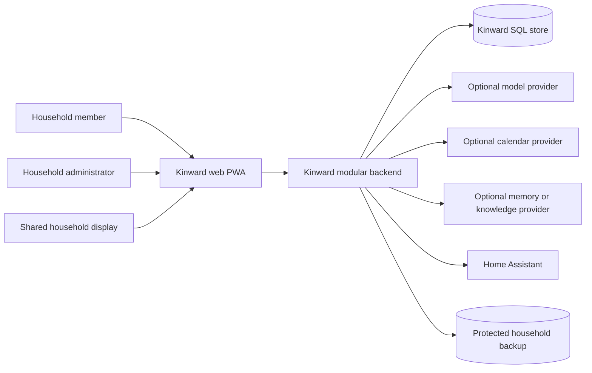
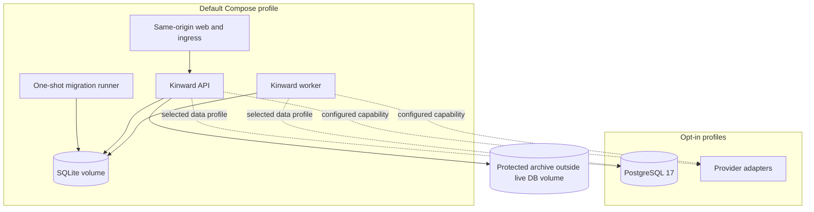
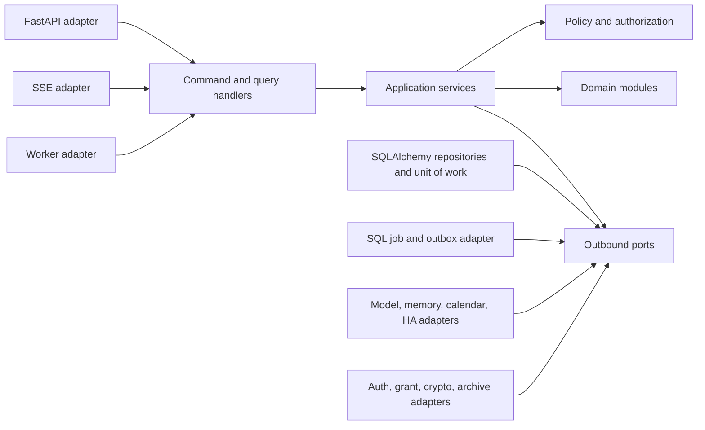
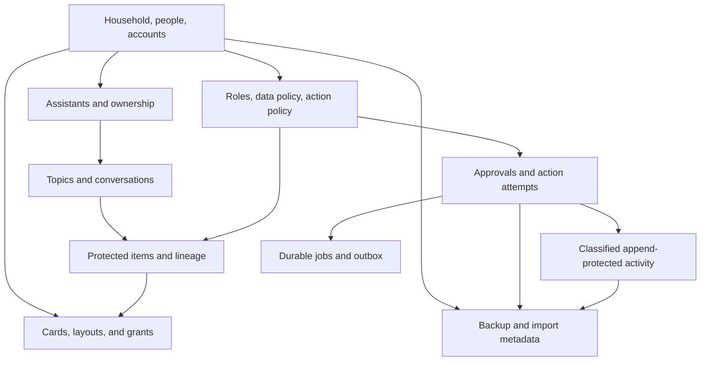
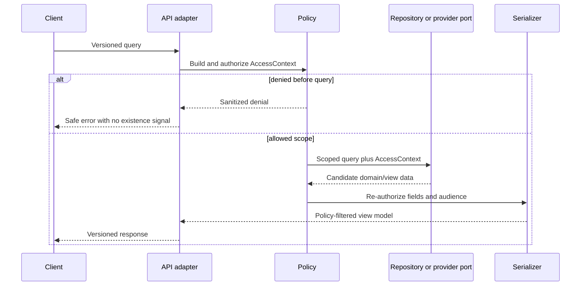
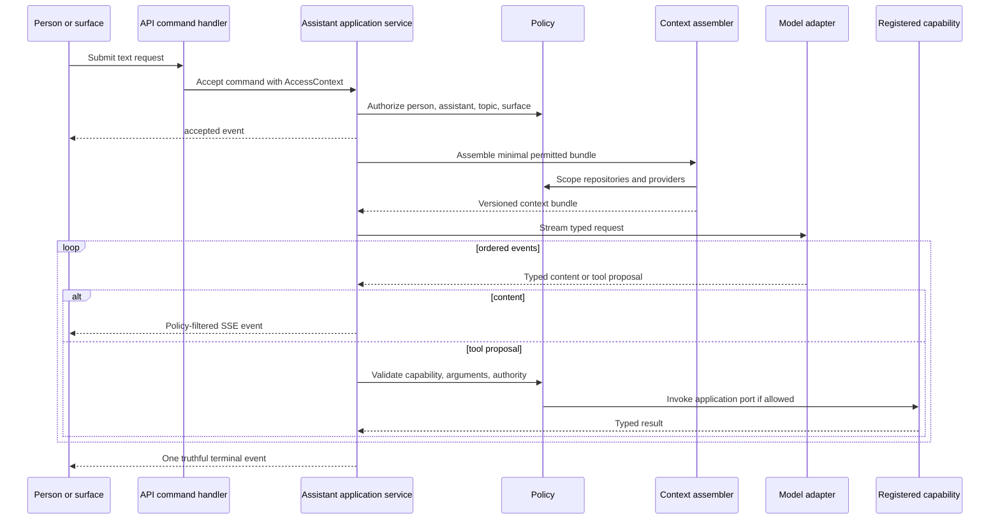
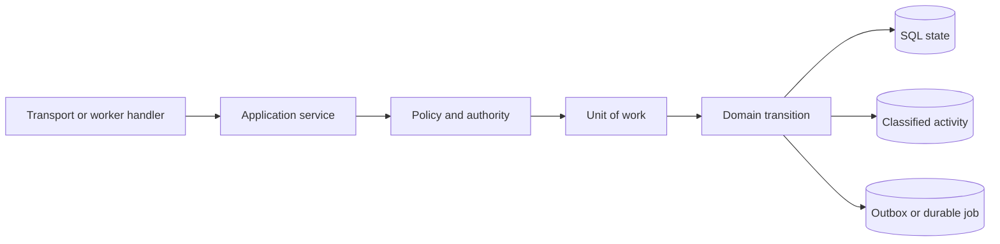
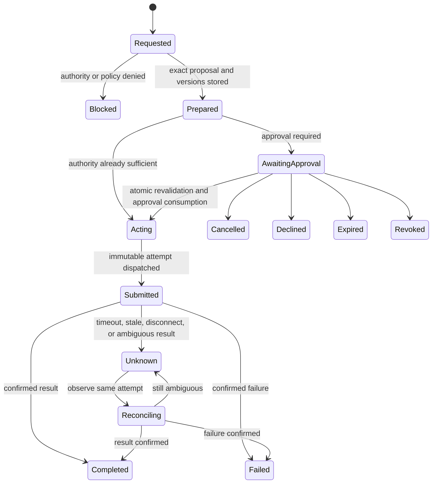
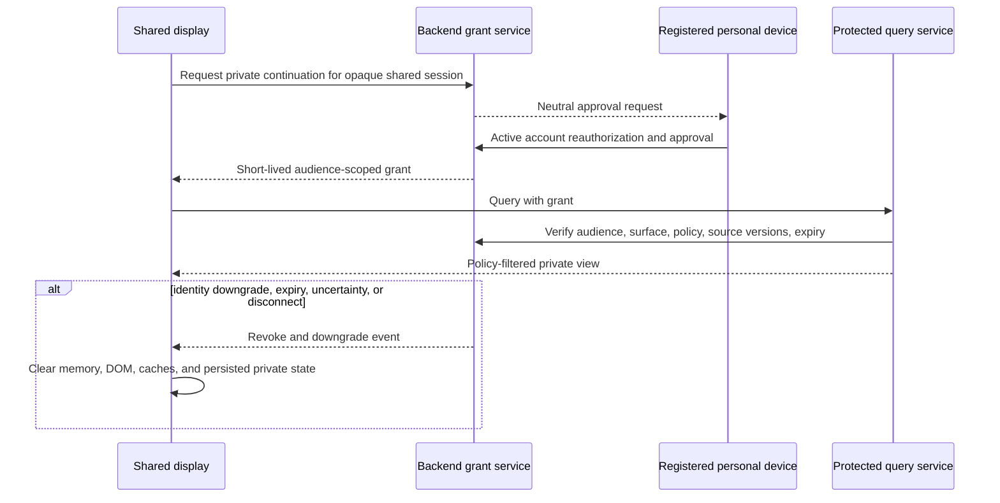
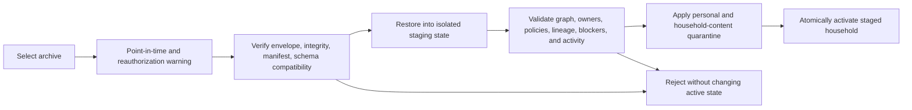

# Kinward Solution Design

## Document role

This document explains the architecture for human review. [ARCHITECTURE-SPINE.md](ARCHITECTURE-SPINE.md) is normative: when this narrative and the spine differ, the spine governs. The scope is the current PRD's committed Milestones A–D. Product horizons are described only as deferred work and do not authorize epics or stories.

## Context

Kinward is a private household intelligence platform deployed once for exactly one household. Each account-bearing person has one primary personal assistant; a separate household-owned fallback serves household-safe contexts. Kinward combines local household state, policy, assistant orchestration, optional providers, registered-card surfaces, meaningful external actions, and recoverable household-owned data without a SaaS control plane.

The repository already establishes a useful brownfield foundation:

- a Python 3.12 FastAPI, SQLAlchemy, and Alembic backend;
- a React 19, Vite, TypeScript, and Zod PWA foundation;
- workspace packages for TypeScript contracts and client schemas;
- Docker Compose with SQLite as the default and PostgreSQL as an optional profile;
- a card registry, optional memory/knowledge and Home Assistant adapters, and `001_initial_single_household` as the new migration origin.

That foundation is not yet architectural compliance. The current setup route writes directly through SQLAlchemy, API routes are not under `/api/v1`, the API image runs migrations at startup, the optional `data` profile includes Redis, `packages/contracts` is hand-authored, no JavaScript or Python lockfile is present, and the baseline schema and card/layout model cover only an initial subset. Milestone A work must converge those seams through application commands, generated API types, aligned manifests/lockfiles, a single migration runner, a Redis-free core, and the complete accepted single-household baseline.

The UX specification expresses a broader product direction than the current PRD. Where they diverge, the current PRD's release boundary governs: text-only committed input, exactly one primary personal assistant, no specialist enablement, no live tablet commitment, and no voice, layout editing, emergency mode, or richer multimodal work without a future amendment.

## Goals

- Give independently built A–D epics one ownership, policy, mutation, contract, deployment, and testing model.
- Keep personal and minor data out of unauthorized queries, provider calls, responses, caches, activity views, and shared displays.
- Preserve truthful state across provider failures, cancellation, restart, backup, restore, and unknown external results.
- Keep SQLite and no-provider operation useful by default while retaining an evidence-gated PostgreSQL option.
- Allow model, memory, knowledge, calendar, and Home Assistant implementations to change behind stable outbound ports.
- Make the PWA adaptive through registered cards and validated layouts without granting the client authority over protected data.
- Make the household independently operable, diagnosable, backed up, and restorable.

## Non-goals

- Multi-household tenancy, tenant identifiers, global household queries, billing, entitlements, support-operator access, or managed control-plane behavior.
- Internal microservices or a distributed event platform.
- Redis as a required session, queue, cache, or coordination dependency.
- Replacing Home Assistant's physical registry, automation engine, or observed-state authority.
- A generic dashboard, routine builder, arbitrary generated React code, or client-side privacy enforcement.
- Committing any PRD Section 4.3 horizon, including email, specialist assistants, voice/multimodal input, context-targeted commands, layout editing, emergency mode, maintenance recall, native Android, or a teen-disclosure exception.

## Version and compatibility posture

The stack is deliberately brownfield-compatible: Node 22, pnpm 10.13.1, React 19.x, TypeScript 5.7.x, Vite 6.1.x, Zod 4.4.3, Python 3.12, FastAPI 0.115.x, SQLAlchemy 2.0.x, Alembic 1.x, SQLite 3 by default, and PostgreSQL 17 optionally. These are adopted compatibility lines, not an installed-version inventory; current manifests contain broader compatible ranges and Milestone A must align manifests and lockfiles without silently upgrading the lines.

Registry checks performed on 2026-07-14 found React 19.2.7, Vite 8.1.4, TypeScript 7.0.2, Zod 4.4.3, FastAPI 0.139.0, SQLAlchemy 2.0.51, Alembic 1.18.5, and pydantic-settings 2.14.2. Those checks establish awareness, not an upgrade mandate. The repository's declared compatibility lines win until an explicit upgrade decision includes migration notes, type/build verification, API/schema compatibility, and the full relevant test suite.

## Alternatives considered

| Decision | Selected | Alternative | Why the selected option fits |
| --- | --- | --- | --- |
| Backend shape | Hexagonal modular monolith | Internal services | One household, one policy authority, and transactional state/activity/outbox benefit from one process and database boundary. Services would add network failure and distributed ownership before an independent scaling boundary exists. |
| Default database | SQLite required; PostgreSQL optional | PostgreSQL mandatory | SQLite makes the private household deployment self-contained and matches current configuration. PostgreSQL remains available for measured operational needs, but only after the same transaction and behavior suite passes on both. |
| Client transport | REST JSON plus SSE | WebSocket | Commands and queries map naturally to HTTP semantics; SSE provides ordered one-way progress, simple same-origin cookie auth, proxy compatibility, and reconnect behavior. Client-to-server cancellation remains an explicit command. Bidirectional sockets add state and recovery complexity without a committed need. |
| Durable work | SQL job/outbox | Redis queue | State, action attempts, activity, and dispatch intent can commit atomically in one SQL transaction. SQL leases support household-scale at-least-once work. Redis would create a second durability and recovery boundary and is not needed for the expected load. |
| API contract ownership | Pydantic/OpenAPI plus generated TS | Hand-maintained Python and TS domain models | One wire authority prevents drift. Client-only card/layout/config schemas remain shared in Zod because they are intentionally client-facing rather than duplicate domain models. |
| Provider integration | Outbound capability ports | Provider SDKs in routes/domain/UI | Stable Kinward types keep privacy, freshness, degraded behavior, and test doubles consistent across provider changes. |

## System context

The database is authoritative for Kinward state. Home Assistant is authoritative for physical state. Other external systems are optional capability providers; none can become the only place where Kinward's household policy, topic continuity, action truth, or recovery state exists.

## Container and deployment view

The default production topology serves the built web client and API through one origin so secure cookies, CSRF controls, SSE, and browser policy remain simple. Development may use Vite's proxy. A migration container built from the backend image runs once and gates API/worker readiness; neither API nor every replica races to migrate. The worker is the same backend image with a different entry point.

The current Compose file is migration input, not the final topology. PostgreSQL must receive its own opt-in profile instead of implicitly bringing up Redis. The current API-internal migration command must move to the one-shot runner before the deployment gate is accepted.

## Backend component model

The component boundary is enforced by dependency direction, not by separate deployables:

- Domain modules contain framework-free state machines, value types, and policy-relevant invariants.
- Application services implement use cases, require `AccessContext`, and own the unit-of-work boundary.
- Inbound ports describe commands and queries. Outbound ports describe repositories, providers, clocks, IDs, crypto, jobs, and archives.
- Adapters translate HTTP, SQLAlchemy, provider SDKs, encryption, and worker leasing into those ports.
- Modules collaborate through application ports. They do not import another module's database adapter or mutate another module's tables directly.

Suggested domain/application modules are household and identity, assistants, topics/conversation, protected context, surfaces/layouts, policy, actions/approvals, coordination/proactivity, integrations, activity, jobs, and backup/import. They remain namespaces inside one deployable backend.

## Data ownership and persistence

### Identity and time

There is one household record and no tenant column or global household repository. Entity IDs are UUIDs. All persisted event times are UTC. The household's configured IANA timezone is versioned configuration used when interpreting review opportunities, local-day limits, display time, and evidence windows; it does not change stored timestamps.

### Protected data

The canonical data classes are `private-person`, `private-child`, `selected-share`, `household-shared`, `surface-ephemeral`, and `system-operational`. Child and teen are policy classes, not data classes. Every protected item uses one metadata shape: owning principal type (`person`, `household`, or authorized surface session) and UUID, data class, item version, and a versioned audience-policy or grant reference. A derived item adds exact source IDs, source versions/classes, transformation version, and expiry. Repositories may normalize this shape differently, but application ports and policy cannot.

A privacy-filtered share is always a new record. It never changes the source record's class. Mixed-owner derivation requires every source owner's matching authority. Access is denied by default and an explicit denial overrides an allow. Narrowing, current-grant revocation, expiry, source change, deletion, or authorization revocation invalidates downstream records and removes them from queries, provider context, shared/fallback context, caches, and rendered state. Missing ownership, audience, or lineage is denial, not a reason to guess.

### Knowledge state and external deletion

Knowledge state is independent of data class: `confirmed-durable-fact`, `pending-inferred-observation`, or `transient-context`. A pending observation stores subject and authorized owner, source identities/versions, class, confidence, creation time, and a fixed 30-day expiry. Before confirmation it is inspection-only for the authorized owner; it cannot personalize or rank assistance, trigger proactivity, authorize an action, enter a shared/fallback view, or enter provider context for another task.

Confirmation creates a new versioned durable fact. Rejection, deletion, or expiry removes the candidate body, invalidates dependents, and prevents recurrence from the same source identity/version. When an external provider cannot delete immediately, Kinward immediately blocks every local and provider query through that reference, marks it `deletion-pending` or `externally-retained`, invokes a provider deletion operation when exposed, and tells the owner which provider limitation remains.

### AccessContext

Protected commands, queries, repositories, and provider ports receive an immutable `AccessContext` containing at least:

- authenticated actor and account/lifecycle state;
- acting assistant and authority basis;
- surface class and audience or grant;
- requested purpose/capability;
- relevant role, sharing, action, and source-policy versions;
- opaque correlation ID.

Client-supplied person, topic, or surface IDs never construct authority. The server derives and verifies the context from the authenticated session, stored bindings, current policy, and short-lived grants.

### Read and serialization flow

Authorization before the query prevents overfetch and provider disclosure. Authorization before serialization protects against stale policy, mixed records, and accidental field growth. Filter counts, empty states, facets, and SSE events follow the same rule.

## API and contract design

All application HTTP endpoints live under `/api/v1`. Command endpoints accept an idempotency key where replay matters and return a command/request identity plus initial state. Query endpoints return policy-filtered view models. Errors have a stable machine code, household-safe message, correlation ID, and retryability where useful; they do not contain provider payloads or protected existence hints.

SSE streams ordered typed events for one request or assistant session. Each event carries schema version, stream/request ID, sequence, UTC time, correlation ID, event type, and policy-filtered payload. Reconnect resumes from a server-known cursor when retention permits; otherwise the client queries current request state. A terminal event is emitted once. Cancellation is a REST command and remains authoritative even if the stream disconnects.

Evolution within `/api/v1` and its SSE major is additive. Older clients ignore unknown optional object fields. They may ignore an unknown non-terminal event only by preserving sequence and querying current state; they never infer a terminal result. An unknown major version, required enum value, or terminal semantic fails closed with upgrade-required behavior. Breaking changes use a new major API/event/schema version. Generated-client compatibility fixtures cover every supported surface.

Backend Pydantic models and generated OpenAPI define wire envelopes and generated TypeScript client types in `packages/contracts`. `packages/schemas` defines only layouts, card instances, surface/client configuration, and other intentionally shared client schemas. Provider-native data and persistence records never become client contracts.

## Assistant orchestration flow

The model sees only the minimum context required for the task. It may suggest a typed capability invocation but cannot choose the actor, source authority, approval policy, or direct provider payload. A capability that mutates state enters the command/action flow below; it is never executed inside the model adapter.

With no configured model, the platform still authenticates, serves local topics and configuration, supports Kinward Control and backup, and reports the assistant capability as unavailable or degraded. It does not fabricate a response.

## Command and transaction flow

Every mutation has one path:

The state row, append-protected activity, and outbox intent commit together. An adapter failure after commit does not erase intent; the worker resumes it. A route, card, model adapter, provider adapter, or worker callback cannot commit tables directly.

Optimistic versions protect user-visible concurrent edits and prepared actions. Commands use idempotency keys for bootstrap, invitations, corrections, import, action transitions, handoff redemption, and other replay-prone work. Duplicate equal commands return the prior result; conflicting reuse is rejected.

## Meaningful external-action flow

Preparation stores the exact target and fields, source/freshness versions, principals, action policy/assignment version, consequence, expiry, reversibility, immutable prepared-mutation identity, and canonical namespaced `ActionTargetKey`. The target key contains the capability/provider namespace, Kinward resource type, stable mapped resource identity, and declared conflict scope. Prepared proposals may coexist, but a database-enforced conflict lock allows at most one attempt in `acting`, `submitted`, `unknown`, or `reconciling` for a conflict key. State transitions use expected-version compare-and-set and terminal results are immutable.

Multi-principal decisions use one canonical approval object containing requester, represented adult/minor, target owner/minor, affected adult/minor, prepared/policy/assignment/source versions, eligible decision makers, explicit `any-one`, `all`, or `threshold(k)` quorum, every independently required affected-principal approval, sharing-authority references, and expiry. Responses serialize; exact duplicates are idempotent and conflicting duplicates fail. Before acting, precedence is authority/policy revocation or integration disablement, expiry, requester cancellation, satisfied decline, then approval. The transition to `acting` atomically revalidates every object field, current identity/account state, affected-person set, sharing, provider freshness, and conflict lock while consuming approval.

The provider adapter receives an immutable attempt ID and provider idempotency data. Approval is already consumed when dispatch begins. A timeout or ambiguous response becomes `unknown`; it is never translated to success and never automatically retried. The target remains blocked until reconciliation observes the same attempt and current provider state. Restart, backup, restore, assistant deletion, account transition, and person deletion-pending preserve that blocker.

Home Assistant confirmation requires a fresh matching physical observation. A service-call acknowledgement alone means submitted, not completed. Calendar confirmation likewise compares provider identity/version and resulting state. Autonomous Milestone D actions use the same state machine and must disclose either a verified inverse or irreversibility before authority is exercised.

## Durable jobs and outbox

The unit of work writes an outbox or job row containing type, versioned payload reference, aggregate/target key, attempt or idempotency identity, availability time, lease owner/expiry, attempt count, and status. The worker claims rows with database-specific locking implemented behind one repository contract. Action dispatch also acquires the database-enforced `ActionTargetKey` conflict lock. Handlers are safe under at-least-once delivery and return a durable result before acknowledging completion.

Retries are limited to operations whose contract proves they are safe. Reads, notifications with deduplication identity, and idempotent projection work may retry within policy. External mutations in `unknown` never retry. Poisoned jobs reach a visible terminal/dead state and create sanitized operational activity without exposing payload bodies.

SQLite uses short transactions and a single logical writer for lease-sensitive work. PostgreSQL may use row locking such as skip-locked behavior inside its adapter, but domain semantics and tests remain identical. Redis is unnecessary for the expected household workload and would weaken transactional recovery if introduced as a second source of dispatch truth.

## Shared-display privacy flow

Shared displays begin household-safe. `unknown` and `expired` receive only household-shared content plus the PRD's narrow operational allowlist. `candidate` adds only a neutral salutation. `group` receives household-shared data and excludes `selected-share`. Private retrieval is possible only after explicit device-mediated reauthorization produces a short-lived audience-scoped grant.

Passive sensing can help choose `unknown`, `candidate`, or `group`; it cannot create `verified` authority. This baseline is an explicit architecture assumption to confirm before the Milestone C evidence catalog freezes. Any replacement method must preserve the same grant, downgrade, timing, and failure behavior.

Private-device handoff uses a different single-use reference. Before destination authentication its payload contains only a neutral instruction, opaque reference, expiry, and destination capability. Redemption atomically rechecks intended person, active account, topic, surface, sharing, source/dependency versions, revocation, and expiry. Replay or wrong-person use reveals neither content nor the existence of a protected item.

Service workers, IndexedDB, local storage, caches, screenshots generated by the app, and error-report payloads on shared displays cannot persist private content. Loss of authorization freshness clears rather than waits.

## Frontend design

The PWA has two route-shell families:

- Assistant Experience for Now, Briefing, Continue, Ask, topics, approvals, results, and personal settings.
- Kinward Control for people, assistants, policy, integrations, surfaces, activity, backup, and health.

They may share design tokens and primitives but not default navigation, information density, or authorization assumptions.

The server creates policy-filtered view models. Cards do not query private providers or decide whether a field is authorized. Each card registration declares type/version, supported surfaces, view-model schema, renderer, sizing, and capabilities. Layouts reference registered card types only and are parsed by versioned Zod schemas.

Layout resolution is deterministic:

1. explicit surface assignment;
2. person plus surface;
3. room plus surface;
4. household surface profile;
5. immutable product default.

Visibility then uses already-authorized view-model availability and safe surface capabilities; it cannot broaden server policy. Invalid layout/config versions are rejected and the last valid version stays active. Generated Milestone D views use only registered cards and declare `ephemeral`, `topic`, or `pinned` disposition. `surface-ephemeral` content disappears on normal end, crash, restart, or authorization uncertainty.

The mock-backed Milestone A gate renders Assistant Presence, Now, Briefing, Continue, Schedule, House Status, Approval, and Assistant Input across personal mobile, personal tablet, personal desktop, shared kitchen, and shared living-room contexts. Live scope then narrows to mobile, desktop, and at least one shared display as the PRD requires.

## Provider adapters and credentials

Every outbound provider port defines:

- capabilities and maximum supported authority;
- health state and actionable reason;
- freshness or observed time/version;
- timeout and safe retry classification;
- Kinward request/result types;
- immutable attempt/idempotency behavior for mutations.

Adapters never pass provider-native objects to routes or cards. Home Assistant mappings translate raw entity/service identifiers into household-safe room/device/action language; technical mappings are visible only inside authorized Kinward Control. Calendar adapters normalize event identity, version, observed time, granted scope, and freshness. Memory/knowledge adapters receive only minimized policy-filtered context and cannot become authoritative for durable facts or topic state.

Provider credentials belong to a person or the household, not to an assistant. Assistant-scoped grants and integration references are distinct revocable records. Credential ciphertext uses a random data-encryption key and authenticated envelope; the data key is wrapped by a deployment key supplied outside the database. Associated data binds ciphertext to credential owner, provider, purpose, and record version. Logs and responses never contain plaintext or unrestricted provider payloads.

## Authentication and security

### Account baseline

Local credential verifiers use an Argon2id-equivalent password hash with parameters recorded for future rehash. Successful authentication creates an opaque high-entropy session secret; only its verifier/hashed representation and metadata are stored server-side. The browser receives it only through a `Secure`, `HttpOnly`, `SameSite` cookie. Session records bind the existing person/account, issuance and expiry, security version, and revocation state.

Account state is exactly `active`, `disabled`, `locked`, or `recovery-pending`; `deletion-pending` is a separate person-lifecycle overlay. Only an active account without that overlay may create work or use personal authority. Entering a non-active state or deletion-pending atomically invalidates sessions, invitations, grants, approvals, handoffs, delegations, provider access, and proactivity and cancels unsubmitted work. Submitted and `unknown` attempts retain reconciliation blockers. Deletion-pending exposes only minimum reconciliation. Reactivation requires same-profile proof, new security artifacts, and revalidation of every current policy/share/grant; it never revives expired work or releases restore quarantine.

State-changing requests require explicit CSRF defense in addition to `SameSite`; the exact synchronizer or double-submit mechanism is deferred to a security story. Same-origin production removes a need for broad CORS. Login, recovery, invitation, grant, and redemption endpoints receive local abuse controls and stable privacy-safe errors.

Invitation and recovery secrets are random, one-time, expiring, and hashed in the database. They bind one intended existing profile and cannot silently create a duplicate or move an account to a different profile. Account disablement, lock, recovery-pending, deletion-pending, binding suspicion, password/security-version change, or restore invalidates relevant sessions, grants, invitations, approvals, and handoffs in the database.

External OIDC is deferred. No OIDC abstraction may weaken the local profile-binding, revocation, or recovery semantics if later introduced.

### Authorization and privacy

- Backend policy applies before protected repository/provider queries and before serialization.
- Administrator role grants management capabilities, never another adult's private content.
- Teen private content has no current emergency, legal, guardian, administrator, or operator exception outside an owner-authorized privacy-filtered record.
- Minor action approval and private-data sharing are separate authorities; being a named approver does not authorize a private teen-derived field.
- Every provider input is minimized; external/model content is untrusted and cannot alter system policy or action authority.
- Sanitized denials and operational events contain opaque references, not protected bodies or existence signals.

### Activity integrity

Meaningful action, security change, deletion, backup, and restore activity is inserted transactionally with the state transition and outbox intent. Its immutable envelope contains only sanitized classified metadata, opaque references, outcome, protected-payload digest/reference, prior chain value, and keyed digest; database guards reject envelope update/delete and the integrity key remains outside the database. Protected detail and audience-specific views are separately classified payloads with independent authorization. Verification detects envelope deletion, reordering, or mutation. Corrections append a superseding record.

Required data/person deletion erases or crypto-shreds the protected payload and appends a disposition event; it does not rewrite the envelope or chain. Only the PRD-permitted sanitized tombstone/envelope and minimum reconciliation state remain. Backups created afterward exclude the erased payload. An older archive may contain it, but restore places it in AD-12 quarantine and grants no administrator inspection authority.

The hash chain supplements authorization; it does not make all activity household-readable. Canonical records and separately classified participant/approver views follow the PRD audience matrix.

## Backup, restore, and import

### Backup

Backup is an application command, not a raw volume copy exposed to users. It acquires an application-coordinated mutation/worker barrier or transactionally consistent checkpoint at one committed boundary; no external dispatch crosses the snapshot, and state, activity, outbox, jobs, deletion overlays, and unresolved-action blockers cannot come from different commits. It either preserves every blocker or refuses export. The manifest records schema/contract versions and classifies included, excluded, externally referenced, rebuildable, and reauthorization-required data.

The archive receives confidentiality and integrity protection. Provider credentials, sessions, refresh/device trust, invitations, approvals as bearer capabilities, handoff references, and other nonportable secrets are excluded. Portable account-recovery material is separately declared and protected. The archive is written outside the live database volume and finalized only after manifest, ciphertext, and integrity verification succeed.

### Restore

Restore never applies directly over a valid active household and never merges staged rows into it. The adapter builds a whole-authority replacement in isolated staging, runs full structural and semantic verification, invalidates pre-restore security artifacts, and assigns required quarantine. Activation is one atomic adapter operation: a validated SQLite database file/volume switch or a validated PostgreSQL database/schema promotion. A failed validation leaves the prior valid deployment untouched. Restored unresolved attempts and jobs are non-dispatchable until their explicit reconciliation path resumes.

All personal accounts restore disabled. Personal, child, selected-share, personal-assistant, and personal-integration data remains quarantined until the same owner reauthenticates and explicitly accepts disposition. Direct household-authored content restores under the current administrators' joint authority: any current administrator may quarantine; one may republish/narrow/export/delete only when no conflicting disposition exists against the same base version; conflict requires all current administrators or an explicit versioned household policy; ambiguity stays quarantined; and removal of the last administrator is rejected. Derived shared statements never reactivate and require a new transformation from current authorized sources. An absent, deleted, or non-reauthenticated owner gives administrators no inspection or release right. Unknown action attempts and deletion-pending overlays remain blocked and cannot become complete.

### Controlled import

The controlled importer targets a valid `001_initial_single_household` database through application commands. It accepts only the versioned allowlist: people/relationships, exactly one primary assistant plus personality for each mapped account-bearing person, confirmed durable facts with provable ownership/class, non-secret integration config, and Home Assistant mappings. It rejects credentials, security artifacts, derived shared statements, tenant/control-plane/billing/support records, unknown classes, and ambiguous ownership.

The whole candidate graph validates before commit. Exact duplicates are idempotently reported; conflicting duplicates reject the whole import. Personal and selected-share content enters same-owner quarantine; qualifying direct household content enters current-administrator quarantine. Any invalid record rolls back the complete import.

## Observability and operations

Operational signals use structured events and opaque correlations shared with user-visible safe errors and classified activity. Ordinary telemetry excludes prompts, conversation/message bodies, private titles, credentials, provider payloads, person-identifying activity, and cross-person metadata.

Health has two levels:

- Core: process, database, migration/schema compatibility, local command/query path, worker/outbox, and backup readiness.
- Capability: model, memory, knowledge, calendar, Home Assistant, and other adapters, each with `available`, `degraded`, `unavailable`, `intentionally-disabled`, `stale`, or `reauthorization-required` plus a safe next step.

An absent optional provider does not make core unhealthy. Metrics cover request/provider latency, provider failures, action results, unknown/reconciliation counts, job backlog/age, policy denials, shared-display downgrade timing, backup/restore outcomes, and database contention. Labels use bounded categories only; person, topic, action target, provider object, and correlation IDs are log fields, never metric labels.

Diagnostic bundles are generated from an explicit allowlist containing component versions, core/capability health, bounded configuration facts, and opaque correlation references. Any new diagnostic field requires review and allowlist inclusion; redaction after collecting unrestricted objects is not acceptable.

## Test strategy and release evidence

| Layer | Required evidence |
| --- | --- |
| Domain | State-machine examples and property/model tests for accounts, pending observations, sharing/lineage, approvals, `ActionTargetKey` conflict locks, actions, coordination, handoff, deletion, quarantine, and restore. |
| Application | Command/query tests proving policy order, idempotency, optimistic concurrency, atomic state/activity/outbox, cancellation, and degraded behavior. |
| Ports/adapters | Contract suites run against null/fake and real adapter implementations; provider payloads normalize to Kinward types and timeouts/freshness are explicit. |
| Persistence | One suite on SQLite and PostgreSQL for transaction boundaries, constraints, leases, idempotency, conflict-key uniqueness, append envelopes/payload deletion, concurrent approval/action transitions, snapshot barriers, and restore/import semantics. PostgreSQL is not advertised before it passes. |
| Privacy/security | Full role, account-state, data-class, adult/teen/child, assistant, shared-identity, action-principal, activity-audience, denial/existence, downgrade, cache, and provider-query matrices. |
| API/contracts | Pydantic/OpenAPI compatibility, generated TypeScript compilation across supported surfaces, additive-version and unknown-version/field fixtures, SSE order/reconnect/terminal behavior, CSRF/session/revocation tests. |
| Web E2E | Playwright across five mock foundation contexts and live mobile/desktop/shared flows, including private absence, handoff, downgrade clearing, Kinward Control separation, generated views, and degraded providers. |
| Backup/import | Protected archive verification, clean-deployment staged restore, old-snapshot quarantine, absent/deleted owner, unknown action/deletion blockers, credential exclusion, controlled import atomic rollback. |
| Accessibility | WCAG 2.2 AA automation plus keyboard journeys and the fixed shared-display fixture at 100% and 200% text scale, including distance inspection and non-color status. |
| Performance | p95 gates on the frozen reference host/display/network/load for personal home, request acceptance, streaming first content, local API, and privacy downgrade clearing. |
| Public safety | Synthetic fixtures only; scan outputs for secrets, private household values, internal endpoints, and production artifacts. |

Milestone evidence uses the PRD's frozen catalog, version/hash, complete case variants, owners, and automatic blocking-defect rules. A sample cannot substitute for zero-tolerance privacy, authorization, action-record completeness, backup loss, restore release, or false-completion checks.

## Milestone architecture slices

### Milestone A — foundation

- Converge the repository on the modular seams, one migration runner, Redis-free default, generated contract direction, and optional provider profiles.
- Complete the accepted `001_initial_single_household` baseline without legacy migration dependency. Because the baseline is not released yet, amend/regenerate `001` before the Milestone A evidence freeze; after that freeze, use forward-only upgrade migrations.
- Render the common card set through one registry and layout resolver across all five mock surface contexts.
- Prove clean `docker compose up` core health without optional providers and preserve current compatibility pins.

### Milestone B — first live slice

- Add local account/session auth, `AccessContext`, `/api/v1`, SSE, assistant orchestration, local topic persistence, and cancellation.
- Demonstrate mobile request, incremental response, persisted topic, desktop continuation, and one live shared display.
- Prove authorized household-safe shared representation and byte/field absence of an unshared private topic.

### Milestone C — usable household

- Complete household/account/assistant lifecycles, facts/observations/lineage, minor and adult policy matrices, grants/handoff, calendar, Home Assistant, approvals/actions/activity, SQL jobs, Kinward Control, backup/restore, and controlled import.
- Run dual-database persistence, security, restore, accessibility, performance, and frozen evidence gates.
- Keep nudge, interruption, autonomous action, non-calendar proactivity, specialists, and non-committed horizons disabled.

### Milestone D — coordination and bounded proactivity

- Add generated view dispositions, minimum-necessary coordination terminal states, versioned review opportunities, configured nudge/interruption categories, and bounded autonomous actions.
- Reuse the same policy, lineage, action, activity, outbox, reconciliation, and evidence architecture.
- Deliver and test the specialist delegation prerequisite record without creating, invoking, or enabling a specialist.

## Migration and selective salvage approach

No subsystem moves because it existed previously. For each retained behavior:

1. document the useful current behavior;
2. identify and remove tenant, control-plane, entitlement, support-access, and routine assumptions;
3. define the Kinward domain/application port and data/privacy contract;
4. move or rewrite the smallest useful implementation behind an adapter;
5. add focused contract, policy, and integration tests;
6. pass the public-repository safety review.

Current code is triaged as follows:

| Current element | Disposition under this design |
| --- | --- |
| FastAPI app and settings | Retain tooling; move routes to `/api/v1`, thin handlers, and capability-based health. |
| Setup route | Rewrite as bootstrap command with auth/recovery bootstrap boundary, policy, unit of work, fallback assistant, idempotency, and activity. |
| SQLAlchemy models and `001` | Preserve the new origin; complete the accepted baseline before freeze, add constraints/lineage/jobs/security/action state, then use forward migrations. |
| Integration HTTP client and Home Assistant seam | Refactor behind outbound ports with `AccessContext`, capability, freshness, immutable attempts, and normalized results. |
| Memory/knowledge adapters | Retain only as optional projections/retrieval adapters; local SQL remains authoritative and provider-native privacy terms are translated. |
| React/Vite PWA and card registry | Retain tooling and registry concept; replace static private examples with server-filtered view models and add the versioned layout resolver/surface shells. |
| `packages/contracts` | Replace hand-maintained domain summaries with generated API client types. Remove currently exposed specialist/temporary capability from committed flows. |
| `packages/schemas` | Keep for explicit card/layout/config schemas; align terms and versioning with current PRD without treating them as domain authority. |
| Compose PostgreSQL/Redis `data` profile | Split PostgreSQL into its own opt-in profile; leave Redis unused/remove it from required topology. |
| Dockerfile migration-on-start | Replace with a one-shot migration runner and separate API/worker commands from the same image. |

Legacy schema history is never replayed. Legacy data enters only through the controlled, versioned, allowlisted import and its quarantine rules.

## Decision-to-requirement mapping

The PRD architecture register is resolved as follows:

| PRD architecture decision | Spine disposition | Main requirements |
| --- | --- | --- |
| AD-01 authentication/session/invitation/recovery | AD-01 | FR-002, FR-005–FR-008, FR-028, FR-083, FR-085, FR-093, NFR-007 |
| AD-02 model streaming/cancellation | AD-02, AD-03 | FR-013, FR-017, NFR-019, NFR-029 |
| AD-03 assistant runtime/tool boundary | AD-03, AD-19, AD-20 | FR-052, NFR-005 |
| AD-04 topic/conversation persistence | AD-04, AD-05 | FR-014–FR-016 |
| AD-05 context authorization points | AD-05 | FR-021, FR-030, NFR-001 |
| AD-06 physical storage split | AD-04, AD-06 | FR-018–FR-020, NFR-010, NFR-029 |
| AD-07 external derived-data deletion | AD-07 | FR-026 |
| AD-08 calendar sync/freshness | AD-08 | FR-057–FR-061 |
| AD-09 Home Assistant freshness | AD-09, AD-20 | FR-064–FR-067 |
| AD-10 shared identity/signaling | AD-10 | FR-029, NFR-020 |
| AD-11 jobs/reconciliation | AD-11, AD-20 | FR-052–FR-053, FR-060, FR-074, FR-077, FR-083, FR-086–FR-087, FR-093–FR-094, FR-100, NFR-012, NFR-015–NFR-016 |
| AD-12 credentials/backup | AD-12 | FR-074–FR-078, FR-084–FR-086, NFR-002, NFR-013–NFR-014, NFR-038 |
| AD-13 activity append protection | AD-13 | FR-053–FR-054, FR-081–FR-083, FR-094, NFR-009, NFR-039 |
| AD-14 diagnostic redaction | AD-14 | NFR-037 |
| AD-15 reference deployment/load | AD-15 | NFR-017–NFR-024, NFR-039 |
| AD-16 private-device handoff | AD-16 | FR-099, NFR-007 |

Cross-cutting product invariants map to AD-17 (single household/time), AD-18 (paradigm), AD-19 (mutation), AD-21 (contracts), AD-22 (frontend), AD-23 (deployment), and AD-24 (assistant cardinality). The spine's capability map is the normative A–D decomposition bridge.

## Risks and mitigations

| Risk | Consequence | Mitigation / gate |
| --- | --- | --- |
| Current skeleton is mistaken for compliant architecture | Direct writes, unversioned APIs, partial auth/privacy, or Redis coupling survive into epics | Milestone A convergence checklist and dependency/contract tests; current gaps are explicitly listed above. |
| SQLite and PostgreSQL diverge under concurrency | Approval, job lease, or action behavior differs by deployment | One shared persistence contract suite with database-specific adapter tests; do not advertise PostgreSQL before it passes. |
| SQLite write contention grows | Slow commands or worker starvation | Keep transactions short, serialize lease-sensitive writes, measure queue age/lock time, and promote to PostgreSQL only with evidence. |
| Shared-display verification assumption is unsuitable | Milestone C cannot safely enter `verified` | Confirm device-mediated flow before evidence freeze; safe interim remains household-only with no verified state. |
| Provider timeout creates duplicate real-world actions | Money, calendar, messages, or physical state changes twice | Immutable attempts, provider idempotency where offered, `unknown` preservation, same-target block, reconciliation-only retry policy. |
| Policy complexity creates field/existence leaks | Cross-person or minor privacy breach | Pre-query and pre-serialization policy, typed view models, complete matrices, byte/field assertions, zero-tolerance gate. |
| Backup key loss or archive corruption | Household cannot restore | Document key custody/rotation, verify archives at creation, perform scheduled clean restores, and refuse unverifiable exports/restores. |
| Append-chain concurrency or key loss weakens evidence | Activity tampering is undetected or unverifiable | Single serialized chain/checkpoint contract per household, database guards, external key custody, dual-database integrity tests. |
| Optional provider becomes de facto mandatory | Core startup or local household use fails | Null adapters, per-capability health, no-provider E2E, and default Compose gate. |
| Compatibility pins age while latest releases advance | Security or ecosystem drift | Reality-check regularly; upgrade only through explicit decision with migration and full validation. |
| Scope leaks from the broader UX direction | Unready voice, specialists, editing, or surveillance-sensitive features enter backlog | PRD milestone mapping and Deferred list are required inputs to epic/story review. |

## Assumptions and deferred decisions

### Assumptions requiring confirmation

- Shared-display `verified` uses explicit approval from an active account on a registered personal device. Passive recognition cannot grant private authority. Confirm or amend before Milestone C evidence freeze.
- The reference evidence host is Linux x86_64 with 4 vCPU, 8 GiB RAM, SSD, and normal LAN; the display is a 21.5-inch 1920×1080 landscape touch panel using Chromium kiosk at 100% scale and 1.5 metres. Freeze exact builds, load, and network before evidence collection.

### Mechanisms intentionally left to lower-level design

- CSRF token pattern, cookie naming/rotation, password library parameters, session durations, recovery transport, and abuse thresholds.
- Initial model/calendar/memory/knowledge providers, calendar webhook versus polling, freshness TTLs, and Home Assistant observation cadence.
- SSE cursor/framing details and generated-client tooling.
- Job polling, leases, batching, retry schedules, and partitioning; Redis remains non-required.
- Envelope algorithm suite, key rotation/custody, archive encoding/destination, hash-chain encoding/checkpoints, and integrity verification UX.
- Passive identity sensors, confidence thresholds, device discovery, handoff delivery channel, and destination notification.
- Reverse proxy/TLS product, host packaging, backup storage product, and PostgreSQL promotion thresholds beyond the mandatory test gate.

### Product decisions using current safe interims

- Shared-display private sessions default to at most 10 minutes.
- No child durable-fact category is guardian-visible by default.
- Calendar remains provider-neutral.
- Milestone C enables only calendar-change ambient/briefing proactivity; Milestone D categories wait for PD-04.
- The named durable retention classes have no automatic deletion while required privacy/security deletion and user deletion remain available.
- Provider credentials are excluded from backups and require reauthorization.
- Shared-display explanation is household-safe; full correction continues on an authorized private device.

### Non-committed horizons

Email; additional personal assistants; specialist creation, invocation, or delegation; voice-only and personal multimodal input; context-targeted commands; richer topics/cards/proactivity; visual or declarative layout editing; emergency mode; any teen-disclosure exception; maintenance recall; progressive onboarding; live personal-tablet workspaces; whole-household deletion; and native Android remain unavailable. Each needs a future PRD amendment, journeys, FR/NFR traceability, privacy/failure gates, milestone placement, and an architecture amendment before decomposition.
