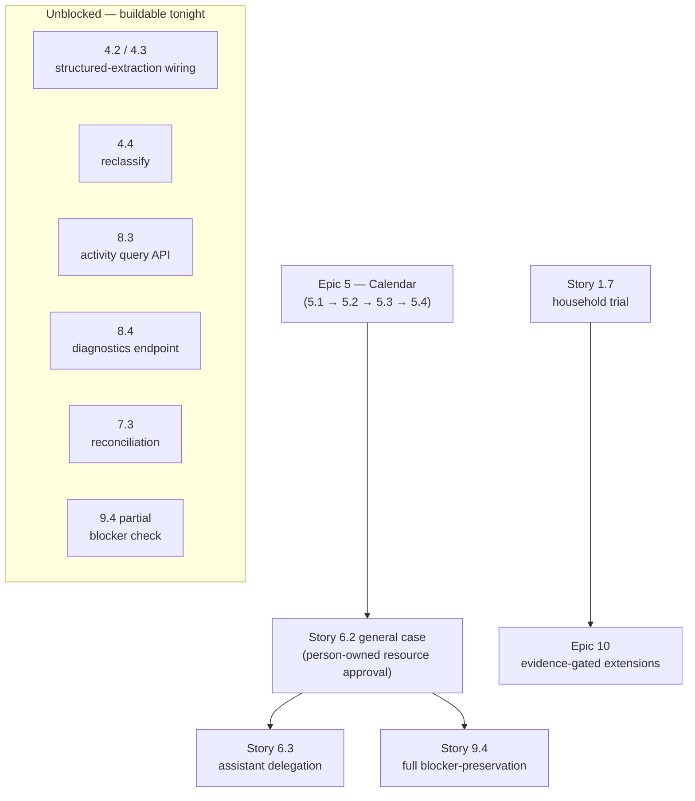

---
stepsCompleted:
  - step-01-validate-prerequisites
  - step-02-design-epics
  - step-03-create-stories
  - step-04-status-audit-2026-07-17
status: execution-tracked
revisionDate: 2026-07-17
homeAssistantBaseline: 2026.7.2
inputDocuments:
  - _bmad-output/planning-artifacts/prd-Kinward-Assistant-Experience.md
  - _bmad-output/planning-artifacts/architecture/architecture-kinward-2026-07-14/ARCHITECTURE-SPINE.md
  - _bmad-output/planning-artifacts/architecture/architecture-kinward-2026-07-14/SOLUTION-DESIGN.md
  - _bmad-output/planning-artifacts/ha-native-pivot-2026-07-15.md
  - docs/pivot/single-household-pivot-and-rebuild-plan.md
  - docs/pivot/salvage-matrix.md
supersedes:
  - standalone five-surface frontend decomposition
  - Story 1.6 exceptional visual foundation
---

# Kinward — Home Assistant Native Epic Breakdown

> **2026-07-17 status audit.** Sections 4–6 below (status dashboard, story-by-story
> remaining work, dependency map, tonight's execution queue) were verified against the
> live codebase, not just against the inline "Implemented"/"Not yet built" notes scattered
> through the epic bodies further down — those notes are accurate as history but the old
> "Immediate execution queue" (section 6 in the 2026-07-15 revision) was stale by the time
> it was written and has been replaced. Treat sections 4–6 as the current source of truth
> for "what's left"; the per-epic bodies below remain the source of truth for acceptance
> criteria and implementation history.

## 1. Purpose

This revision preserves Kinward's backend, household, assistant, privacy, memory, action, provider, activity, backup, restore, and operational requirements while replacing the standalone Kinward frontend with Home Assistant as the committed application shell.

Home Assistant owns dashboards, responsive rendering, mobile access, areas, devices, entities, physical state, service execution, and Assist voice pipelines. Kinward owns household intelligence and exposes it through a documented Home Assistant custom integration.

The implementation target for this revision is Home Assistant Core **2026.7.2**. CI and local development must pin the supported version rather than depend on an unbounded latest image.

## 2. Scope correction

### Removed from committed scope

- Standalone `apps/web` Assistant Experience
- Five Kinward-owned surface shells
- Kinward card registry and renderer registry as product architecture
- Kinward layout resolver, layout persistence, and layout editor
- Kinward design-token and primitive system
- Standalone PWA and Kinward-owned mobile shell
- Running Home Assistant or HACS cards outside Home Assistant
- Story 1.6 and its visual approval gates

### Preserved

All non-UI requirements in the PRD and architecture remain active unless this document explicitly changes their presentation mechanism. In particular, preserve:

- Single-household deployment and atomic bootstrap
- Profile/account binding, invitations, roles, privacy classes, and minor policy
- Personal and household assistants and ownership boundaries
- Truthful conversation lifecycle, cancellation, topic continuity, and context authorization
- Personal memory, household-shared knowledge, inferred-observation confirmation, correction, deletion, lineage, and provider degradation
- Server-side authorization and shared/private disclosure boundaries
- Proactive prioritization, calendar change detection, coordination, approvals, and meaningful-action reconciliation
- Home Assistant action policy and fresh-observation completion rules
- Activity, audit, health, diagnostics, backup, restore, import, deletion, and recovery
- Provider-neutral ports for models, memory, knowledge, calendars, communications, and Home Assistant
- SQLite default, optional PostgreSQL parity, SQL jobs/outbox, modular-monolith boundaries, and public-repository safety

## 3. Cross-cutting architecture rules

1. Kinward remains a hexagonal modular monolith with framework-free domain and application layers.
2. The HA integration is an adapter. It must not own household policy or directly mutate persistence.
3. Every protected request carries immutable Kinward access context derived from the Home Assistant person entity synced to that request's HA user - not an explicit admin-configured mapping (superseded 2026-07-16: Kinward has no identity system of its own; every HA `person` entity syncs automatically, keyed on its durable HA person id).
4. Being an HA administrator makes a synced person a Kinward administrator too (role is read from HA's own admin flag on every sync pass, plural admins supported, no separate Kinward-side designation - superseded 2026-07-16). That household role never by itself grants another adult's private Kinward data - role and privacy authorization remain separate axes (see Story 3.3).
5. Standard HA entities are used only when state is compact, useful in dashboards/automations, and safe for HA history/logbook.
6. Private bodies, secrets, unrestricted payloads, prompts, and large nested documents must not be placed in entity state or attributes.
7. Rich data uses authorization-checked backend APIs or integration WebSocket commands only when required.
8. Home Assistant remains authoritative for areas, devices, entities, and observed physical state.
9. HA action success means submitted. Kinward marks an action completed only after the required fresh confirming observation.
10. Optional providers degrade independently and truthfully.
11. The default distributable dashboard uses only core HA cards. Optional HACS enhancements must be additive.
12. Custom frontend cards or panels are deferred until real household usage proves a core-card limitation.

## 4. Epic summary

| Epic | Outcome | Status |
| --- | --- | --- |
| 1 | A healthy Kinward backend and HA 2026.7.2 integration can be installed and used today. | ✅ Done (1.7 trial not yet *run*) |
| 2 | Household members can speak or type to their private Kinward assistant through Assist with truthful lifecycle behavior. | ✅ Done |
| 3 | The household and account graph is safely established and managed through backend workflows and HA-hosted configuration entry points. | ✅ Done |
| 4 | Topics, memory, knowledge, and corrections remain private, inspectable, and portable across authorized HA interactions. | 🟡 Core lifecycle built; nothing calls it from a real conversation yet |
| 5 | Kinward produces useful briefings and calendar-aware attention without becoming a notification feed. | ⬜ Not started |
| 6 | Meaningful actions and household coordination are approved, executed, reconciled, and recorded safely. | 🟡 v0 slice only (no-owner HA-capability case) |
| 7 | Home Assistant state and actions are used through policy-bound, observation-confirmed adapters. | 🟡 v0 slice only (read + write paths exist, no reconciliation) |
| 8 | Administration, health, activity, and diagnostics are available without exposing protected content. | 🟡 Health exists; activity + diagnostics APIs missing |
| 9 | Backup, restore, import, retention, deletion, and recovery preserve the complete household authority model. | ⏸️ Deferred to v2 (9.4 admin-invariant/retention partially done) |
| 10 | Advanced generated views, custom cards, and broader clients remain evidence-gated extensions rather than foundation blockers. | ⏸️ Evidence-gated — blocked on real usage from the Story 1.7 trial |

## 5. What's left, story by story

Verified against `services/kinward/src/kinward` and `custom_components/kinward` on 2026-07-17,
not just against the prose notes in each epic body. "Blocked by" is empty when a story is
buildable right now with no other story's output as a prerequisite.

| Story | Status | What's left | Blocked by |
| --- | --- | --- | --- |
| 1.1–1.6 | ✅ Done | — | — |
| 1.7 | 🟡 Not yet run | Run `docs/ha-native/household-trial.md` end to end, log defects/missing-UI observations | `scripts/ha-dev-smoke.sh` must pass first (no code blocker) |
| 2.1–2.5 | ✅ Done | — | — |
| 3.1 | ✅ Done | — | — |
| 3.2 | 🚫 Eliminated | N/A — superseded by HA-native identity (no invitation flow to build) | — |
| 3.3–3.4 | ✅ Done | — | — |
| 4.1 | 🟡 Unverified | Confirm existing topic/turn persistence actually satisfies the AC; likely no new code | — |
| 4.2 | 🟡 Partial | Wire `propose_fact` into the conversation flow via a structured-extraction step | none — buildable now |
| 4.3 | 🟡 Partial | Same extraction step must call `propose_observation`; it is currently dead code in production | shares 4.2's extraction step |
| 4.4 | 🟡 Partial | Add fact reclassification (privacy-class change) once the owner-widen-unilaterally question is answered | needs a one-line product decision, not code |
| 4.5 | 🟡 Partial | Verify `health.py` capability states satisfy the AC end to end; consider surfacing them via 8.4's diagnostics endpoint | benefits from 8.4 |
| 5.1 | ⬜ Not started | Person-owned calendar provider port + credential storage | none — but large; start fresh, not overnight |
| 5.2 | ⬜ Not started | Change-detection engine over calendar events | blocked by 5.1 |
| 5.3 | ⬜ Not started | Briefing generation + HA sensor | blocked by 5.1, 5.2 |
| 5.4 | ⬜ Not started | Delivery policy (quiet hours, interruption caps) | blocked by 5.3 |
| 6.1 | 🟡 v0 slice | Generalize the state machine beyond the capability-risk-tier case | needs 6.2's resource types to generalize against |
| 6.2 | 🟡 v0 slice (different case than the AC describe) | Build the person-owned-resource approval case (ADR-002's worked example: Lisa reschedules Marc's calendar event) | blocked by Epic 5 — no protectable person-owned resource exists yet |
| 6.3 | ⬜ Not started | Assistant-to-assistant delegation | blocked by 6.2's general case |
| 6.4 | ✅ Done | — | — |
| 7.1 | ⬜ Not started | Versioned HA entity/area mapping abstraction | none, but low priority — live lookups already work |
| 7.2 | 🟡 v0 heuristic | Persist `recent_actions`/`active_timers` only if the 1.7 trial shows live HA lookup isn't reliable enough | none — build only if evidenced |
| 7.3 | 🟡 v0 write path | Add per-service expected-state confirmation + an async reconciliation job | none — buildable now |
| 7.4 | ⬜ Not started | Automation event/trigger hooks | soft-depends on 7.1–7.3 stabilizing |
| 8.1 | 🟡 Partial | Add polling/push + feature-enablement options to the config flow | none |
| 8.2 | 🟡 Mostly done | Remaining scope is already covered by 3.1/3.3/3.4's admin-authority work | — |
| 8.3 | ⬜ Not started | Authorized activity **query** API over the `ActivityRecord` rows already being written | none — buildable now, purely additive |
| 8.4 | 🟡 Partial | Sanitized diagnostics endpoint (allowlisted versions, capability states, opaque correlations) wrapping `health.py` | none — buildable now, small |
| 9.1–9.3 | ⏸️ Deferred to v2 | — | intentionally deferred, see Epic 9 goal note |
| 9.4 | 🟡 Partial | Full blocker-preservation needs 6.2's general case; a partial version checking existing capability-tier `ApprovalRecord` rows before deletion is buildable now | full slice blocked by 6.2; partial slice is not |
| 9.5 | 🚫 N/A | HA owns login/recovery entirely | — |
| 10.1–10.4 | ⏸️ Evidence-gated | Blocked on real household-usage data | blocked by 1.7 actually being run for a while |

## 6. Dependency map — what's blocking what

Reading it: only two real dependency chains exist in the whole backlog.

1. **Epic 5 (calendar) gates Epic 6.2's general case, which gates Epic 6.3 and the full
   version of 9.4.** ADR-002's own worked example for cross-person approval is "reschedule
   someone else's calendar event" — there is no person-owned resource to protect until
   calendar events exist. HA device control (today's v0 slice) has no owner, so it never
   needed this and shipped already.
2. **Story 1.7 (the trial) gates Epic 10.** Custom cards/panels/clients are explicitly
   evidence-gated on real usage; nobody has used it yet, so nothing in Epic 10 is
   actionable regardless of code state.

Everything else in the "What's left" table — 4.2/4.3, 4.4, 7.3, 8.3, 8.4, and the partial
slice of 9.4 — has **no dependency on unfinished work**. It's unbuilt because nobody has
built it yet, not because something else is in the way.

## 7. Tonight's execution queue (target: ready by 09:00)

Ordered by dependency (none of these block each other) then by value/effort. Sizes are
rough: S ≈ 30–45 min, M ≈ 1–1.5 h, L ≈ 2–3 h.

1. **[S] Run the Story 1.7 trial** (`docs/ha-native/household-trial.md`). Do this *first*,
   not last — it's the cheapest way to find out whether Epics 1–3 actually hold up outside
   of unit tests before spending the night building more on top of them. Log every defect
   instead of working around it.
2. **[S] Story 9.4 partial** — before deleting a person, check for their unresolved
   capability-tier `ApprovalRecord` rows (`pending`/`approved`-not-yet-executed) and refuse
   or tombstone-preserve rather than cascading through them silently. Small addition to
   `application/person_deletion.py`.
3. **[M] Story 8.3** — `GET` activity query endpoint over `ActivityRecord`, authorization-
   filtered per cross-cutting rule 6/AC ("filtering occurs after record/view authorization
   and leaks no unauthorized counts or facets"). The rows already exist from 3.x/6.x/7.x
   work; this is a read path only.
4. **[S] Story 8.4** — sanitized diagnostics endpoint wrapping the existing
   `CapabilityHealthSet`/`CoreHealth` from `health.py`: allowlisted versions + capability
   states + opaque correlation ids, explicitly excluding prompts/bodies/secrets per the AC.
5. **[S] Story 4.4 reclassify** — add privacy-class reclassification to
   `application/knowledge.py` alongside the existing `correct_fact`/`delete_fact`. Default
   to **admin-only, narrowing-or-lateral only** (no unilateral owner-widen from personal to
   household-shared) unless product overrides that before you start — flag the assumption
   in the commit.
6. **[L] Story 4.2/4.3 — structured-extraction wiring.** The biggest and most valuable item
   tonight: add the extraction step that turns a model reply into `propose_fact`/
   `propose_observation` calls, so the lifecycle built in the last merge (`5aa1e5b`) has a
   real caller instead of only test coverage. This is the one item worth protecting time
   for if the night runs short — everything else in this queue is smaller and more optional.
7. **[M, stretch] Story 7.3 reconciliation** — only if time remains after #6: per-service
   expected-state confirmation and an async reconciliation pass in `worker.py` for the
   ambiguous `unknown`-outcome case already recorded in `ActivityRecord`.

**Deliberately not tonight:** Epic 5 (calendar/briefings). It's four stories of genuine
greenfield work — provider port, credential storage, change detection, briefing
generation, delivery policy — and it's the next real epic after this queue, not a
rushed 3 a.m. addition. Start it fresh with a full session, not as a stretch goal here.

# Epic 1: Installable HA-Native Household Foundation `✅ Done`

## Goal

From a clean checkout, start Kinward and a pinned Home Assistant 2026.7.2 development instance, install the Kinward integration, and display a useful core-card dashboard with truthful health and household state.

### Story 1.1: Preserve the backend deployment foundation `✅ Done`

As the household operator,
I want the existing Kinward backend foundation retained and revalidated,
So that the UI pivot does not discard working domain, persistence, policy, worker, and deployment capability.

#### Acceptance criteria

- Existing single-household backend, database, migration, API, worker, outbox/job, policy, and test foundations are inventoried and retained when compatible.
- `docker compose up` starts a healthy core Kinward stack without optional providers.
- SQLite remains the required default; PostgreSQL remains optional and unadvertised until parity passes.
- No standalone frontend is required for backend readiness.
- The old five-surface frontend is isolated from active build and test gates before deletion.

### Story 1.2: Preserve atomic household bootstrap `✅ Done`

As the initial administrator,
I want the household graph created atomically and duplicate-safely,
So that the HA pivot does not weaken identity, assistant ownership, or privacy foundations.

#### Acceptance criteria

- One transaction creates the household, initial administrator/profile binding, primary personal assistant, fallback assistant, and selected adult, child, and pet profiles.
- Retry is duplicate-safe.
- Exactly one household exists per deployment.
- Pets receive no account, assistant, private memory, credentials, approval, delegation, or authority.
- Existing Story 1.2 tests remain authoritative after presentation dependencies are removed.

> **Superseded (2026-07-16, HA-native identity redesign):** Kinward has no local accounts, so bootstrap
> no longer creates an "initial administrator" at all - it only creates the household, the fallback
> assistant, and any pets. People (including whoever ends up administrator) exist solely via HA
> `person` sync (see Story 3.1's note). "As the initial administrator" and "initial
> administrator/profile binding" above no longer describe the implementation; retained for history.

### Story 1.3: Add a pinned Home Assistant development profile `✅ Done`

As a developer,
I want a reproducible HA 2026.7.2 environment,
So that integration behavior can be tested against the actual supported platform.

#### Acceptance criteria

- Local development provides a documented HA 2026.7.2 container/profile with persistent config outside source-controlled secrets.
- The Kinward backend and HA can start together without requiring optional model, memory, knowledge, or calendar providers.
- Version compatibility is explicit in docs and CI.
- Upgrade tests fail visibly when an unsupported HA version is introduced.

### Story 1.4: Create the Kinward custom integration and config flow `✅ Done`

As the household operator,
I want to configure Kinward through Home Assistant's UI,
So that installation does not require editing dashboard or integration internals.

#### Acceptance criteria

- `custom_components/kinward` includes a versioned manifest, config flow, translations, coordinator/client boundary, diagnostics redaction, and uninstall/reload behavior.
- Configuration accepts the Kinward backend URL and performs a bounded health check.
- Duplicate integration entries are rejected safely.
- Authentication material is stored using HA-supported config-entry mechanisms and is never logged.
- Backend unavailable, authentication failure, incompatible API, and configuration error are distinct.

### Story 1.5: Expose the initial safe entity set `✅ Done`

As a household member,
I want useful Kinward state in ordinary Home Assistant cards,
So that I can use Kinward without custom frontend development.

#### Acceptance criteria

- Initial entities include `conversation.kinward`, backend availability, household status, briefing, attention count, next household event, and last successful refresh where useful.
- HA `person.*` entities remain authoritative for presence; Kinward profiles may map to them without duplicating presence state.
- Entity state and attributes are bounded, sanitized, and safe for recorder/logbook exposure.
- Stale, unavailable, disabled, and configuration-error states are distinguishable.
- Entity updates are coordinated and do not cause duplicate backend polling.

### Story 1.6: Ship the first core-card Kinward dashboard `✅ Done`

As a household member,
I want a simple dashboard I can use immediately,
So that backend behavior can be tested in daily life before custom UI work resumes.

#### Acceptance criteria

- An importable dashboard named Kinward uses only built-in HA cards by default.
- The first view shows household-member status using HA person tiles/status chips, household status, today's calendar, briefing, attention items, conversation access, and integration health.
- The dashboard is usable in HA web and Companion apps without Kinward-owned responsive code.
- Optional HACS examples are documented separately and never required.
- The dashboard remains truthful when Kinward is unavailable.

### Story 1.7: Verify the same-day usable slice `🟡 Not yet run — tonight's queue #1`

As the product owner,
I want one end-to-end household trial,
So that planning is replaced by real usage quickly.

#### Acceptance criteria

- Install the integration on HA 2026.7.2.
- Configure a Kinward backend entry.
- Display at least one HA person state and one Kinward-produced summary.
- Run refresh or briefing generation from HA.
- Submit one text request through `conversation.kinward` or an explicitly temporary action fallback.
- Stop Kinward and verify truthful unavailable behavior.
- Record defects and observed missing UI needs without immediately creating custom cards.

# Epic 2: Private Assistant Through Home Assistant Assist `✅ Done`

## Goal

Each account-bearing person can use exactly one private primary assistant through HA Assist while Kinward preserves person, assistant, topic, surface, and authorization boundaries.

### Story 2.1: Map HA users to Kinward profiles `✅ Done`

- An HA user maps to at most one account-bearing Kinward profile.
- Missing, stale, disabled, deleted, or ambiguous mappings fail closed.
- Mapping changes are versioned and audited without protected content.
- HA administrators gain no role-derived access to another adult's private data.

> **Superseded (2026-07-16, HA-native identity redesign):** there is no explicit admin-configured
> mapping step or `HaUserMappingRecord` anymore - every HA `person` entity syncs automatically, and
> `PersonRecord.ha_user_id` (set only while that person has an HA login) is the resolution key, kept
> current every sync pass instead of admin-edited. "Fails closed" still holds exactly as stated: no
> row for that `ha_user_id` resolves to nothing. The last bullet is unchanged and still load-bearing:
> being an HA admin makes someone a Kinward admin (cross-cutting rule 4), but that role alone still
> grants no access to another adult's private data - only privacy classification does (Story 3.3).

### Story 2.2: Implement the Kinward conversation entity `✅ Done`

- A `ConversationEntity` sends policy-filtered requests to Kinward.
- Conversation IDs preserve authorized multi-turn continuity.
- Accepted, responding, completed, cancelled, uncertain, and failed outcomes remain truthful.
- Model/tool output is treated as untrusted typed proposals.
- No-model operation still supports local commands and truthful capability reporting.

> **Implemented (2026-07-16):** `application/conversation.handle_conversation_request` now generates a
> real reply instead of always returning the "no model configured" placeholder. A new `kinward/llm/`
> package (`ModelProvider` protocol; `OpenAiCompatibleModelProvider` for OpenAI/Ollama/vLLM/llama.cpp/LM
> Studio, `AnthropicModelProvider`, and `NullModelProvider` for the truthful no-model-configured state)
> is called with the full prior-turn history as context. "No-model operation still supports truthful
> capability reporting" holds exactly as before via `NullModelProvider` - never a fabricated reply.
> Provider/model/API key are admin-editable per household (`ProviderSettingsRecord`), changed live from
> the Kinward integration's options flow in Home Assistant; the API key is never echoed back once set.
> Tests in `tests/test_llm_providers.py` and `tests/test_conversation.py`.

### Story 2.3: Support cancellation and terminal integrity `✅ Done`

- Cancellation stops further model output and prevents every unsubmitted action.
- Exactly one terminal outcome is recorded.
- Unknown provider or action results survive restart and are reconciled before retry.
- HA UI limitations must not weaken backend cancellation semantics.

### Story 2.4: Continue topics across authorized HA clients `✅ Done`

- Topics are durable work contexts, not raw chat sessions.
- The same authorized person can continue a topic across HA web and Companion apps.
- Authorization is re-evaluated on every request.
- Topic rename, archive, reopen, reclassify, inspection, and deletion remain backend capabilities even if the first HA UI exposes only a subset.

### Story 2.5: Preserve the household fallback assistant boundary `✅ Done`

- One household-owned fallback assistant has no personal owner.
- It cannot query private personal memory.
- Shared-display or unmapped-user requests receive only household-safe context.
- Private continuation requires authenticated handoff to the intended person's authorized client.

# Epic 3: Household, Profiles, Invitations, and Assistant Setup `✅ Done`

## Goal

Safely manage household people and assistant ownership while keeping initial HA-hosted setup minimal.

### Story 3.1: Manage pre-account people and pets `✅ Done`

- Administrators can create adult and minor profiles before accounts exist.
- Pet profiles remain optional and household-shared only.
- Initial setup does not require rooms, devices, routines, detailed schedules, notification rules, or dashboard editing.

> **Superseded (2026-07-16, HA-native identity redesign):** the "people" half is gone - administrators
> don't create profiles at all anymore. Every HA `person` entity (with or without a linked login) syncs
> in automatically as a Kinward profile; a no-login person (e.g. a young child) is simply a `person`
> entity with no `user_id`, which already *is* the "pre-account person" concept this story wanted -
> nothing separate to build. Only the pet half remains genuinely new work: pet CRUD after bootstrap
> (create/list/update/remove), since bootstrap already accepts initial pets but has no later add path.
>
> **Implemented (2026-07-16):** pet CRUD lives in `application/pets.py`, exposed as
> `GET/POST /api/v1/integration/pets` and `PATCH`/`DELETE /api/v1/integration/pets/{id}`, admin-only
> for mutation (see Story 8.2's admin-plural note). Tests in `tests/test_pets.py` and the API round
> trip in `tests/test_integration_api.py`.

### Story 3.2: Bind invitations without duplicate profiles `🚫 Eliminated (HA owns invitations)`

- Invitations are single-use, expiring, revocable, hashed, and invalid after binding.
- Acceptance binds to the intended existing profile.
- Stale, ambiguous, cross-profile, or replayed acceptance fails closed.

> **Superseded (2026-07-16, HA-native identity redesign):** eliminated entirely. HA already has real
> user management and Kinward has no email-delivery mechanism to build an invitation flow on top of;
> a person becomes usable the moment they exist in HA, via sync. Nothing in this story is built or
> planned.

### Story 3.3: Enforce account, role, privacy, ownership, and authority separately `✅ Done`

- Household role, account state, privacy class, assistant ownership, action authority, retained ownership, reactivation, and deletion overlay are separate concepts.
- Adult, teen, and child policies are deterministic.
- Teen private disclosure remains unconditionally denied outside the exact owner-authorized, privacy-filtered exception.

> **Updated (2026-07-16, HA-native identity redesign):** "account state" is dead - there is no local
> Kinward account. "Household role" is narrower than it reads above and is no longer admin-assigned:
> it is exactly two values, `admin`/`member`, mechanically derived every sync pass from whether the
> synced person's linked HA user is currently an HA administrator (plural admins are expected and
> supported - see cross-cutting rule 4). This story's still-real, still-unbuilt remainder is
> `profile_kind` reclassification (adult/teen/child) and privacy-class management for a synced person -
> that's a genuine admin-facing action this story still owns; admin/member role is not.
>
> **Implemented (2026-07-16):** `application/people.reclassify_person` sets `profile_kind` and keeps
> the person's `classification` (privacy class) in lockstep - `child` -> `private-child`, `adult`/`teen`
> -> `private-person` - never touching `role`. Exposed admin-only as
> `PATCH /api/v1/integration/people/{id}/reclassify`. Tests in `tests/test_people_admin.py` and
> `tests/test_integration_api.py`.

### Story 3.4: Configure the primary assistant `✅ Done`

- Every account-bearing person has exactly one primary personal assistant in the first release.
- The owner sets assistant name and supported personality/interaction preferences.
- Preferences never alter authority, privacy, or action policy.
- Disablement, deletion, and replacement preserve same-owner boundaries and defined content/work disposition.

> **Updated (2026-07-16, HA-native identity redesign):** "account-bearing" now just means "synced from
> HA" - every synced person gets their primary assistant auto-created atomically as part of the same
> sync pass that creates their profile, with a default name. What's left of this story is letting the
> owner rename/customize their own assistant's personality after the fact; auto-creation is no longer
> new scope.
>
> **Implemented (2026-07-16):** `application/assistants.update_own_primary_assistant` lets the resolved
> owner (by `ha_user_id`) rename their primary assistant and/or set its `personality` dict, exposed as
> `PATCH /api/v1/integration/assistants/primary`. It only ever touches the `AssistantRecord`, never the
> owning `PersonRecord`, so preferences structurally cannot alter authority/privacy/action policy.
> Tests in `tests/test_assistants.py` and `tests/test_integration_api.py`.
>
> **Superseded (2026-07-16, multiple assistants per person):** "exactly one primary personal assistant"
> is no longer the rule. A person may have zero, one, or several personal assistants with distinct
> names/personalities - there is no product-enforced ceiling by default. A household may optionally cap
> it (`max_assistants_per_person`) and/or require admin approval to create additional ones
> (`require_admin_approval_for_creation`), both changed from the Kinward integration's options flow in
> Home Assistant (server-stored in `AssistantPolicyRecord`, mirroring `ProviderSettingsRecord`'s
> pattern) - never a locally-stored HA-side file, per cross-cutting rule 2 (the integration is an
> adapter and must not own household policy). The auto-created-on-sync assistant is unaffected by
> policy and always succeeds. Deleting a person's last remaining assistant is blocked (mirrors
> `domain/admin_invariant.py`'s "last admin" protection) - `conversation.kinward` always has something
> to resolve to.
>
> **Implemented (2026-07-16):** migration `008_multiple_assistants_per_person` drops
> `uq_assistants_personal_owner` and adds `assistant_policy`. `application/assistant_policy.py` and the
> expanded `application/assistants.py` (`list_own_assistants`, `create_additional_assistant`,
> `delete_own_assistant`, generalized `update_own_assistant`) implement the policy engine. API:
> `GET/POST /assistants`, `PATCH/DELETE /assistants/{id}` (replacing the old `/assistants/primary`),
> `GET/PATCH /settings/assistant-policy`. HA integration: the two policy knobs join the existing
> options-flow screen; `kinward.create_assistant`/`kinward.delete_assistant` services let a person use
> the new capability today without bespoke dashboard UI (deferred per cross-cutting rule 12). Choosing
> *which* of a person's several assistants a given spoken/typed request addresses (e.g. wake-word/name
> routing - "hey Calopex") is explicitly out of scope here; `conversation.kinward` still resolves to a
> single assistant per person today (deterministically the oldest, if several - see the next note).
>
> **Implemented (2026-07-16, ADR-002 assistant access modes):** a non-owner may now address another
> person's assistant under a deterministic, owner-controlled rule. `AssistantRecord` gained
> `access_mode` (`owner_only` default / `household` / `allowlist`) and `allowed_person_ids`; the
> household-fallback assistant is backfilled to `household` (migration `009_assistant_access_modes`).
> `domain/assistant_access.can_address_assistant` is the single, pure, testable boundary check - owner
> always allowed; `household` allows any resolved person (a single-household deployment has no further
> boundary to check); `allowlist` allows exactly the listed person ids. It governs access to the
> assistant only - never which conversational-memory peer is used (that invariant, `(person, assistant)`
> session keying, already existed and needed no change) and never a tool permission (still unbuilt,
> Epic 7 Story 7.3). `handle_conversation_request` gained an optional `assistant_id` param: unset,
> behavior is unchanged (caller's own, deterministically the oldest if several - fixed a real latent bug
> along the way, since `_find_primary_assistant`'s old query would have raised `MultipleResultsFound`
> the first time a person owned more than one); set, the addressed assistant is looked up and the access
> check enforced, returning a new truthful `AccessDenied`/`AssistantNotFound` outcome rather than
> silently falling back to the caller's own or fabricating a reply. `application/assistants.py` gained
> `list_accessible_assistants` (every assistant a person may address - own plus others' under
> household/allowlist mode) and `update_own_assistant` gained `access_mode`/`allowed_person_ids`. API:
> `GET /assistants/accessible`, extended `PATCH /assistants/{id}`, and `POST /conversation` accepts an
> optional `assistantId`. HA integration: a new `kinward.set_assistant_access` service (resolves
> `allowed_names` display names to person ids via the existing `/people` endpoint) - still no wake-word
> routing, so today this is exercised via explicit `assistantId`/the service, not by speaking a name.
> Tests in `tests/test_assistant_access.py`, `tests/test_assistants.py`, `tests/test_conversation.py`,
> `tests/test_integration_api.py`.
>
> **Not yet built (ADR-002):** tool permissions (allow/approval_required/deny), the operational
> household context layer (recent actions/timers for cross-voice-node continuity), and the approval
> workflow for actions affecting another person's existing resources - all separate, larger pieces of
> ADR-002 not touched by this pass.
>
> **Update (2026-07-16):** the operational household context layer landed as a v0 heuristic (see the
> Story 7.2 note below), and tool permissions plus a capability-risk-tier approval workflow landed as a
> v0 slice (see Epic 6 Stories 6.1/6.2's notes and Epic 7 Story 7.3's note) - but the approval workflow
> for actions affecting *another person's existing resource* specifically (this note's original
> wording, ADR-002 sec. 5's calendar-reschedule example) is still unbuilt; what shipped instead is the
> no-owner capability-gating case. Assistant-to-assistant delegation below remains unbuilt and still
> depends on the general quorum machinery, not this v0 slice.
>
> **Deferred (2026-07-16, until/with Epic 6):** assistant-to-assistant delegation (one assistant asking
> another assistant something on its owner's behalf, e.g. "check with Lisa's AI about Monday") is a
> meaningful action that can affect another person's data - it needs Epic 6's approval/quorum machinery
> before it exists, not a standalone feature built around that safety net. See Epic 6 note below.

# Epic 4: Topics, Memory, Knowledge, and Corrections `🟡 In progress`

## Goal

Provide useful continuity without allowing optional memory systems or inferred knowledge to bypass Kinward policy.

### Story 4.1: Persist authorized topics and context `🟡 Unverified`

- Context is assembled only for the current person, assistant, topic, HA interaction, audience, action, capability, and freshness state.
- Kinward SQL remains authoritative for topics and conversations.
- Provider retrieval is minimized and authorization-bound before query construction.

### Story 4.2: Separate private memory and household-shared knowledge `🟡 Partial — extraction unwired`

- Personal memory is owned by one person.
- Household facts use a separate sharing classification.
- Fallback and shared contexts cannot query private indexes.
- Memory/knowledge providers are optional projections or retrieval adapters.

> **Implemented (2026-07-16):** the previously-built-but-unwired `HonchoMemoryProvider` (conversational
> recall) and `LlmWikiKnowledgeProvider` (household fact search) are now actually called from
> `handle_conversation_request` - `recall`/`search_facts` ground the model's system prompt, and a real
> reply gets appended back to memory. Isolation is per `(household workspace) -> (person peer, assistant
> peer) -> session` - a session keyed by the exact `(person_id, assistant_id)` pair, auto-created lazily
> on first contact. This already satisfies "personal memory is owned by one person" for *any* caller
> addressing *any* assistant, not just an owner talking to their own - a different calling `person_id`
> against the same assistant is structurally a different, isolated session. See ADR-002 for the fuller
> V0 design this generalizes to (per-assistant access modes, tool permissions, approvals) - none of that
> is built yet, only the memory-isolation invariant it depends on.
>
> **Fixed (2026-07-16):** two real bugs found by exercising `HonchoMemoryProvider` against a live Honcho
> instance rather than only mocks - session creation sent `peers` as a list where Honcho's schema
> requires a `dict[str, SessionPeerConfig]` (422 every time, silently masked since Honcho auto-creates
> the session on first message anyway); and `append_messages`/`recall` assumed every response was
> wrapped as `{"items": [...]}`, but Honcho's actual message-create/search routes return a bare
> `list[Message]` - meaning recall and append silently returned nothing against any real deployment
> until fixed. Tests in `tests/test_memory_providers.py`, `tests/test_conversation.py`.
>
> **Not yet wired:** proposing new facts (`propose_fact`) from a conversation - this needs structured
> extraction and confirmation policy (Story 4.3/4.4), not just "call the existing thing," and remains
> unbuilt. Home Assistant entity-state grounding (read-only, separate from memory/knowledge) is Epic 7's
> territory - see the Story 7.2 note.

### Story 4.3: Manage inferred observations `🟡 Partial — extraction unwired`

- Pending observations cannot become durable facts or influence future assistance as facts without authorized explicit confirmation.
- Ownership, correction, confirmation, rejection, fixed expiry, recurrence suppression, dependency invalidation, backup, and restore are deterministic.

> **Implemented (2026-07-16), core lifecycle:** a new `knowledge_facts` table
> (migration `010_knowledge_facts`) is the Kinward-side control layer over
> `KnowledgeStoreProvider` bodies that AD-25 describes - the provider methods
> (`propose_fact`/`confirm_fact`/`revise_fact`/`retire_fact`) already existed
> unwired; nothing called them. `application/knowledge.py` now does:
> `propose_observation` (creates a `pending` row with a fixed 30-day
> `expires_at`, suppresses re-proposal of evidence identical to something
> already rejected via a `recurrence_key` hash); `confirm_observation`/
> `reject_observation` (owner-only, fail closed on anyone else); a worker pass
> (`expire_pending_observations`, wired into `run_worker`'s loop) disposes
> anything past its fixed expiry. Disposal (`reject`/`expire`/`delete`) marks
> `deletion_status: deletion_pending` rather than `none` when the provider
> can't confirm its body is gone, and cascades to invalidate any other fact
> whose `depends_on` names it - `depends_on` isn't populated by anything yet
> (no feature derives one fact from another today), so this cascade is
> structurally ready but currently vacuous, tested directly rather than via a
> real producer. API: `GET /knowledge/observations`,
> `POST /knowledge/observations/{id}/confirm`,
> `POST /knowledge/observations/{id}/reject`. Tests in `tests/test_knowledge.py`,
> `tests/test_worker.py`, `tests/test_integration_api.py`.
>
> **Not yet built:** nothing calls `propose_observation` in production - the
> conversation flow doesn't extract candidate facts from a reply and propose
> them (that needs a structured-extraction step this pass doesn't add; see
> Story 4.2's note). Backup/restore survival is out of scope until Stories
> 9.1-9.3 exist (deferred to v2, per the Epic 9 goal note).

### Story 4.4: Inspect, correct, reclassify, and delete durable facts `🟡 Partial — reclassify missing`

- Users can inspect and correct authorized facts about themselves.
- Every fact records source category, timestamp, sharing class, confirmation state, confidence, and lineage.
- Narrowing, revocation, expiry, source-version invalidation, downstream clearing, and external deletion-pending behavior are enforced.

> **Implemented (2026-07-16), core lifecycle:** built on the same
> `knowledge_facts` table as Story 4.3 above - a confirmed row already records
> source system, creation/confirmation timestamps, `privacy` (sharing class),
> `confidence`, and `record_version`; `provenance()` on the provider remains
> the lineage source of truth (unchanged, already implemented in
> `LlmWikiKnowledgeProvider`, not duplicated locally).
> `application/knowledge.py`'s `correct_fact` (owner-only, confirmed-only,
> revises the provider body) and `delete_fact` (disposes with the same
> deletion-pending/dependents-invalidation behavior as Story 4.3's reject/
> expire) cover "correct" and "delete." API:
> `GET /knowledge/facts`, `PATCH /knowledge/facts/{id}`,
> `DELETE /knowledge/facts/{id}`. Tests in `tests/test_knowledge.py` and
> `tests/test_integration_api.py`.
>
> **Not yet built:** "reclassify" (changing a confirmed fact's `privacy`
> sharing class after the fact) has no dedicated operation - `correct_fact`
> only revises `value`/`confidence` today, matching what the acceptance
> criteria call "correct"; reclassification would need its own authorization
> question (can an owner widen their own fact from personal to
> household-shared unilaterally?) not answered by this pass. Retention
> disposition for this table is documented in
> `docs/architecture/data-retention.md` (`knowledge_fact` lifecycle entry).

### Story 4.5: Degrade memory and knowledge truthfully `🟡 Partial — needs verification`

- Provider failure never becomes a claim that unavailable memory is known.
- Core conversation and household functions remain usable.
- Health indicates disabled, degraded, stale, reauthorization-required, and configuration-error states separately.

# Epic 5: Briefings, Calendar Awareness, and Proactive Attention `⬜ Not started — next epic after tonight`

## Goal

Use Home Assistant dashboards and notifications to surface prioritized household meaning without recreating a notification feed.

### Story 5.1: Connect private person-owned calendars `⬜ Not started`

- Calendar credentials are person-owned and independent of assistant lifecycle.
- Reads are limited to granted scope.
- Provider event identity, version, observed time, account, capability, and freshness are retained.
- Private details do not enter shared HA entity state unless explicitly shared.

### Story 5.2: Detect meaningful calendar changes `⬜ Not started`

- Additions, removals, time, location, attendee, and cancellation changes are detected.
- Attention items are created only for supported overlap, transportation, attendee, or response-obligation predicates.
- Stale calendar state cannot support current-change claims or mutation.

### Story 5.3: Generate prioritized briefings `⬜ Not started`

- Briefings prioritize meaning, recency, required action, uncertainty, and household scope.
- The initial HA sensor exposes a short safe summary; richer private details remain behind authorization-checked requests.
- An empty useful state is allowed.
- Correction and dismissal are durable backend commands even when first exposed through simple HA actions.

### Story 5.4: Deliver at the least disruptive permitted level `⬜ Not started`

- Milestone C is limited to calendar-change ambient or briefing delivery.
- Timezone, quiet periods, confidence fallback, privacy suppression, review opportunities, and interruption caps are deterministic.
- HA notifications are an adapter; Kinward policy selects whether and what may be delivered.

# Epic 6: Approvals, Actions, and Household Coordination `🟡 v0 slice only`

## Goal

Every meaningful external action is authorized, approved where required, submitted once, reconciled, and recorded truthfully.

### Story 6.1: Implement the meaningful-action state machine `🟡 v0 slice (capability-risk-tier only)`

- Persist immutable attempts, optimistic versions, conflict keys, same-target locking, approval state, submission, unknown result, reconciliation, and terminal outcome.
- Submitted never means completed.
- Unknown attempts survive restart, backup, restore, account transition, assistant lifecycle, and deletion.

> **Scoping note (2026-07-16, ADR-002):** ADR-002's `pending_action` is a concrete instance of the state
> machine this story describes, with a specific state set (`pending`/`approved`/`denied`/`expired`/
> `cancelled`/`executed`/`failed`) and a re-check-at-execution-time rule (approval validity, expiry,
> target-resource existence/unchanged, approver still authorized, tool connection still available) that
> should inform this story's own "unknown attempts survive... and are reconciled" design rather than
> diverge from it. Zero call sites still exist for any of this - `ApprovalRecord` remains schema-only.
>
> **Implemented (2026-07-16), v0 capability-risk-tier slice:** `ApprovalRecord` is wired up for the
> first time - `application/pending_actions.py`'s `request_action`/`resolve_pending_action` implement
> the state machine for ADR-002's *capability-risk-tier* case only (Epic 7 Story 7.3's HA device
> control - see that story's note below), not the general multi-principal/quorum case Story 6.2
> describes. States used: `pending`, `approved`, `denied`, `expired`, `executed`, `failed` (the full
> ADR-002 seven-value enum, now CHECK-constrained in migration `010_meaningful_action_approvals` -
> `cancelled` is defined but has no producer yet). Re-validation immediately before execution
> (`domain/pending_action.revalidate_before_execution`) covers expiry and approval-state, the subset of
> AD-20's five re-check conditions meaningful for a resource with no separate existence/ownership to
> re-verify (an HA entity isn't "deleted" the way a calendar event is). "Submitted never means completed"
> holds structurally: `ApprovalRecord.state` only reaches `executed` after `HomeAssistantClient.call_service`
> returns a non-`None` result (see the Story 7.3 note for what `None` now means). Tests in
> `tests/test_pending_action.py` (domain), `tests/test_pending_actions.py` (application), and
> `tests/test_integration_api.py::test_approval_workflow_requires_admin_and_round_trips`.

### Story 6.2: Enforce general multi-principal approval `🟡 v0 slice — different case than the AC below`

- Approval objects identify principals, quorum, affected-principal approvals, expiry, invalidation, serialized responses, precedence, and exactly-once transition to acting.
- Minor actions apply requester-independent policy and exact named-adult quorum.
- Protected minor conversation and prepared-message bodies are excluded from adult approval by default.

> **Scoping note (2026-07-16, ADR-002):** ADR-002 gives a concrete first case for this story: a
> cross-person action against an *existing* resource (reschedule/cancel/modify a calendar event, and
> later higher-risk HA actions like unlocking a door) becomes a pending approval notified to the
> affected owner rather than executing immediately - approval is one-time by default and must not
> silently become a standing permission. This is single-approver-notified-owner, not yet the general
> quorum/multiple-simultaneous-approvers case this story's "quorum"/"exact named-adult quorum" bullets
> describe - ADR-002 explicitly treats broader permission grants derived from repeated approvals as
> future/deferred work, not V0.
>
> **Implemented (2026-07-16), a different single-approver case than this story's own worked example:**
> ADR-002 sec. 5's worked example (Lisa asks Bob to reschedule Marc's calendar event) needs a specific
> `affected_person_id` who owns the resource and is the one notified/approving - that case is still
> unbuilt (calendars are Epic 5, itself still placeholder). What *is* built is ADR-002 sec. 4's other
> case: HA device control has no per-resource owner (nobody "owns" the front door lock the way Marc
> owns his calendar event), so *any* current household admin resolves it
> (`domain/pending_action.can_resolve_approval`, cross-cutting rule 4's plural-admin model) rather than
> a specific affected person. `ApprovalRecord.affected_person_id` exists in the schema (migration
> `010_meaningful_action_approvals`) for the future person-owned-resource case but is `None` for every
> row this pass produces. Notification is a single household-wide `persistent_notification.create` HA
> call (best-effort, never gating) rather than ADR-002's per-owner mobile-app push - a single-household
> deployment has no specific device to target for "the resource's owner" when there is no owner. See
> Epic 7 Story 7.3's note for the tool-permission side this approval flow is triggered from.

### Story 6.3: Support bounded household coordination `⬜ Not started — blocked by 6.2 general case`

- Coordination uses minimum-necessary context and complete delegation metadata.
- Accept, decline, counter, revoke, expire, cancel, complete, fail, and unknown outcomes close consistently for authorized participants.
- Specialist assistants remain disabled until delegation prerequisites pass.

> **Scoping note (2026-07-16):** this is where assistant-to-assistant delegation belongs - e.g. one
> person's assistant asking another person's assistant something on its owner's behalf ("check with
> Lisa's AI about Monday"), possibly proposing a change to the other person's data. That's a meaningful
> action affecting someone else, so it's explicitly deferred until this story's approval/quorum
> machinery exists rather than built as a standalone messaging feature first - see epics.md Story 3.4's
> note on multiple assistants per person, where the capability was raised and intentionally not built.
> Memory for such an exchange, if/when built, should reuse the same peer-pair session pattern already
> used for person-assistant memory (see ADR-002) rather than a new memory concept - each
> (assistant, assistant) pair gets its own session, auto-created lazily like everything else.

### Story 6.4: Expose safe HA actions `✅ Done`

- HA integration actions invoke application commands rather than persistence or providers directly.
- Selectors and response payloads expose only authorized minimum-necessary data.
- Action calls produce correlatable sanitized activity.
- Retry is blocked while same-target status is unknown.

# Epic 7: Home Assistant State and Device Actions `🟡 v0 slice only`

## Goal

Use HA as the physical-world authority while Kinward adds household language, policy, and reconciliation.

### Story 7.1: Map Kinward household concepts to HA resources `⬜ Not started`

- Areas, devices, entities, and services are referenced by stable HA identifiers.
- Ordinary outputs use household language.
- Raw entity/service syntax is limited to authorized technical diagnostics.
- Mapping changes are versioned and invalid mappings fail safely.

### Story 7.2: Read fresh HA state through a provider-neutral port `🟡 v0 heuristic`

- Observed state includes source identity, observation time, availability, and freshness.
- Unavailable or stale state cannot be represented as current.
- HA-dependent Kinward capability degrades without blocking unrelated core use.

> **Implemented (2026-07-16), read path only:** `HomeAssistantClient.states()` (previously never called)
> is now read during a conversation turn and folded into the model's system prompt when configured -
> read-only, capped and compacted (`entity_id: state` lines), not a new HA connection setting (it reuses
> the existing `home_assistant_url`/`home_assistant_token` deployment settings). This is a first-pass
> grounding mechanism, not the full port this story describes - no per-entity freshness/availability
> metadata is surfaced to the model yet, and there's no write path here (see Story 7.3).
>
> **Scoping note (2026-07-16, ADR-002):** ADR-002 specifies a further "operational household context"
> layer - structured, short-lived state (recent actions, active timers) shared across people, assistants,
> rooms, and voice nodes, so a follow-up like "turn that light back off" or "cancel the timer" resolves
> correctly regardless of who created it or which voice node hears the follow-up. This is explicitly
> *separate* from Honcho conversational memory and from the raw HA-state read above, and does not exist
> yet - `recent_actions`/`active_timers` stores, deterministic reference-resolution ranking, and
> explicit retention/expiry are all new scope this story (or a new one) will need to cover.
>
> **Implemented (2026-07-16), v0 heuristic:** `application/operational_context.py`'s
> `resolve_recent_device`/`resolve_recent_timer` now resolve "most recently changed light/switch"
> and "currently active timer" live from `HomeAssistantClient.states()` (the same fetch already
> used for read-path grounding above, not re-fetched), preferring the caller's current area via
> HA's own `area_id()`/`area_entities()` template functions when a `device_id` is available
> (threaded end-to-end from HA's `ConversationInput.device_id` through
> `custom_components/kinward/conversation.py` and `api.py` to the backend). **No persistence,
> migration, or lifecycle entries were added** - this is a deliberately smaller v0 than the
> `recent_actions`/`active_timers` store this note originally scoped: resolve everything live
> from HA's own state, and only build Kinward-side persistence if household testing shows HA's
> state can't support reliable cross-node lookup. There is no tiered ranking/ambiguity handling
> (current-room > current-assistant > household-window; ringing > only-active > room >
> household-manageable) and nothing can yet act on a resolved device or timer - see
> `docs/architecture/operational-household-context.md`.

### Story 7.3: Execute and reconcile HA mutations `🟡 v0 write path — no reconciliation`

- Identity, permission, resource authority, freshness, approval, and activity policy run before submission.
- Requested, submitted, observed, completed, failed, and unknown remain separate.
- Completion requires a fresh matching HA observation.
- Ambiguous or missing observations preserve unknown state until reconciliation.

> **Scoping note (2026-07-16, ADR-002):** `HomeAssistantClient.call_service()` exists but still has no
> call sites - the write path this story describes remains entirely unbuilt. ADR-002 adds a concrete
> permission model to design against once it is built: tool permissions are deterministic, decided by
> code (`allow` / `approval_required` / `deny`), never by the model, and are evaluated separately from
> assistant access and from which memory peer is active - "may this caller address this assistant" and
> "may this action proceed" are independent questions. Routine shared-device control (lights, switches,
> scenes, media, household-manageable timers) is the example given for likely default-`allow` capability;
> higher-risk actions (locks, garage doors, alarm, cameras, security automations) are the example given
> for default-`deny`/independently-gated. This directly informs "identity, permission, resource
> authority... policy run before submission" above - it does not replace Epic 6's approval/quorum
> machinery, which is what `approval_required` results here would still need to call into.
>
> **Implemented (2026-07-16), v0 write path:** `HomeAssistantClient.call_service()` has its first call
> sites. `domain/tool_permission.py`'s `CAPABILITY_SERVICE_ALLOWLIST` maps concrete `(domain, service)`
> pairs (not a caller-asserted label) to five capabilities - `control_lights`/`control_switches`/
> `manage_household_timers` default `allow`; `control_locks`/`control_alarm_system` default `deny` -
> matching ADR-002 sec. 4's example split. Permissions are admin-editable per household
> (`HomeAssistantToolPolicyRecord`, `GET`/`PATCH /settings/home-assistant-tool-policy`, mirroring
> `AssistantPolicyRecord`'s pattern) but **not yet surfaced in the integration's options-flow UI** -
> callable via the REST contract only for now, same kind of gap Story 8.1 already tracks for other
> settings. `application/pending_actions.request_action`/`resolve_pending_action` run identity
> (`resolve_person`/`resolve_admin`), assistant-access, and capability-permission checks before
> submission - "resource authority" is a cheap in-process check that `entity_id`'s domain prefix
> matches the requested HA `domain` (`InvalidTarget` otherwise), not a live HA existence lookup.
>
> There is still no LLM tool-calling/function-calling support at all (`llm/contracts.py` unchanged) -
> this is invoked explicitly (new `kinward.request_action`/`approve_action`/`deny_action` HA services,
> `POST /api/v1/integration/actions` and friends), the same "backend capability + explicit HA service
> call first" precedent Story 3.4's `kinward.set_assistant_access` set, not something a conversation
> turn can trigger autonomously yet.
>
> `HomeAssistantClient.call_service` now returns `list[dict] | None` instead of always `[]` - `None`
> means the call never went through (disabled/circuit open/HTTP error), a list (even empty) means HA
> accepted and processed it. This still can't distinguish "never sent" from "sent but the response was
> lost to a timeout" (`IntegrationClient.request()` catches both under `httpx.HTTPError`), which matters
> for a possibly-successful lock/alarm call: `ApprovalRecord.state` resolves fail-closed to `failed`
> either way (ADR-002's enum has no `unknown` value), but the paired `ActivityRecord.outcome` is set to
> `unknown` (not `failed`) specifically for the ambiguous case, preserving the true "requested, submitted,
> observed, completed, failed, and unknown remain separate" distinction this story's own AC asks for, one
> layer down from where the enum can't hold it.
>
> **Not built - the full "fresh matching HA observation" rule**: a non-`None` synchronous `call_service`
> response is treated as sufficient evidence of `executed`, the same scoping discipline the read-path note
> above used ("no per-entity freshness/availability metadata surfaced yet"). There is no per-service
> expected-state confirmation matrix (e.g. verifying `light.turn_off` actually left the entity `off`) and
> no async reconciliation job (`worker.py` remains heartbeat-only) - "ambiguous or missing observations
> preserve unknown state until reconciliation" only half-holds: the ambiguity is recorded, nothing
> currently reconciles it. Tests in `tests/test_tool_permission.py`, `tests/test_pending_actions.py`
> (including the `not_configured` vs. `ha_request_failed_after_send` distinction), and
> `tests/test_integration_api.py`.

### Story 7.4: Add purpose-specific HA automation hooks `⬜ Not started`

- Kinward exposes documented events, actions, triggers, or conditions only when they express stable household intent.
- Hooks avoid leaking private details into HA automation traces.
- Generic entity-state automation remains possible for safe compact state.

# Epic 8: Administration, Activity, Health, and Diagnostics `🟡 In progress`

## Goal

Operate Kinward through HA-hosted configuration and backend administration without exposing private content or requiring the retired standalone UI.

### Story 8.1: Provide configuration-entry options and reauthentication `🟡 Partial`

- Integration options manage backend connection, profile mapping, safe polling/push behavior, and feature enablement.
- Reauthentication and reconnect preserve non-secret local configuration.
- Disablement is distinguishable from failure.

> **Superseded (2026-07-16, HA-native identity redesign):** "profile mapping" as an integration option
> is gone - there is no options flow and nothing to map. People sync automatically; admin role is
> derived automatically. The remaining real scope here is backend connection/reauthentication only.

### Story 8.2: Preserve Kinward administrative authority `🟡 Mostly done`

- Authorized administrators manage people, invitations, assistants, child policy, household integrations, proactive defaults, backup, and health.
- Adults manage their own integrations, memory, preferences, and sharing without unrelated administrative access.
- Complex functions may initially use backend CLI/API workflows; lack of a custom panel does not weaken policy.

> **Superseded (2026-07-16, HA-native identity redesign):** "invitations" is dead (Story 3.2). "People"
> here now means the still-real remainder: `profile_kind`/privacy reclassification and pet CRUD (Story
> 3.1/3.3), not creating people (that's sync-only now). "Authorized administrators" (plural, by design)
> means every current HA admin - see cross-cutting rule 4; there is no single distinguished admin to
> authorize against.

### Story 8.3: Provide authorized activity `⬜ Not started — tonight's queue #3`

- Mandatory action and security records are append-protected and transactionally coupled.
- Filtering occurs after record/view authorization and leaks no unauthorized counts or facets.
- HA logbook is not the authority for Kinward private or meaningful-action activity.

### Story 8.4: Provide health and sanitized diagnostics `🟡 Partial — tonight's queue #4`

- Health is separate for application, database, model, memory, knowledge, calendar, Home Assistant, jobs, and backup.
- Every degraded state has an actionable next step or states none is needed.
- Diagnostics use allowlisted versions, capability states, and opaque correlations only.
- Prompts, bodies, secrets, credentials, unrestricted provider payloads, and protected high-cardinality labels are prohibited.

# Epic 9: Backup, Restore, Import, Retention, Deletion, and Recovery `⏸️ Deferred to v2 (9.4 partial)`

## Goal

Preserve the whole household authority graph and all unresolved safety obligations across lifecycle operations.

> **Deferred to v2 (2026-07-16):** Stories 9.1-9.3 (backup, restore, import) are pushed out of the v1
> push-to-real-usage path. The v1 goal is a household member actually using the assistant day-to-day
> as soon as possible; backup/restore protects against loss of a household that's already running, but
> building it now doesn't get anyone closer to a usable day-one assistant, and it's substantial,
> security-sensitive scope (envelope encryption, staged/quarantined restore, atomic activation - see
> AD-12/AD-13 in `ARCHITECTURE-SPINE.md`) that a single household can safely live without for a first
> release. The architecture decisions (AD-12, AD-13, AD-19, AD-20) remain the adopted design for
> whenever this gets built - this defers scheduling, not the design. Story 9.4's own remainder already
> depended on 9.1-9.3 existing (see below) and stays deferred alongside them.

### Story 9.1: Create versioned protected backups (deferred to v2) `⏸️ Deferred to v2`

- Backups contain a versioned manifest with included, excluded, protected, external, rebuildable, pending-observation, deletion, and unresolved-action metadata.
- Export requires confidentiality and integrity protection.
- Credentials excluded under policy are listed as reauthorization tasks.
- Backup archives are stored outside the live database volume.

### Story 9.2: Restore atomically and quarantine before activation (deferred to v2) `⏸️ Deferred to v2`

- Restore targets a clean same/compatible deployment.
- A point-in-time warning is shown before restore.
- The staged graph is validated in isolation and activated atomically.
- Failure leaves the existing valid household unchanged.
- Ownership, account binding, pending observations, deletions, unresolved actions, provider references, and quarantine are verified.

### Story 9.3: Import the documented minimum household data set (deferred to v2) `⏸️ Deferred to v2`

- Import uses a versioned allowlist for the documented five classes.
- Graph validation, duplicate handling, quarantine, disallowed-state rejection, safe reporting, and rollback are atomic.
- Legacy executable migrations are not required; `001_initial_single_household` remains the schema origin.

### Story 9.4: Enforce retention and deletion-pending lifecycle `🟡 Partial — full slice blocked by 6.2`

- Named durable classes have documented retention.
- Ephemeral, invalidated, expired-security, and user-deleted content is removed as specified.
- Person deletion immediately shuts down authority, permits reconciliation-only access, preserves blockers, protects the sole administrator, and reaches atomic final disposition.

> **Needs redesign (2026-07-16, HA-native identity redesign):** "protects the sole administrator"
> assumed exactly one administrator; that assumption no longer holds - any number of people can be
> admins, derived live from HA. Whoever builds this story must redefine the invariant in terms that
> hold under multiple admins (e.g. "a deletion/demotion in HA can never silently leave the household
> with zero admins" is the closest equivalent to today's rule) rather than protecting one named person.
> Also note: Kinward never deletes a `PersonRecord` on its own when a `person` entity disappears from
> HA sync (see Story 3.1's note) - actual deletion is this story's explicit, auditable action, not a
> side effect of sync.
>
> **Partially implemented (2026-07-16):** the redesigned invariant itself is built -
> `domain/admin_invariant.validate_admin_removal` blocks exactly the "would leave zero admins" case,
> not "isn't the one designated admin" - and `application/person_deletion.delete_person` wires it into
> an explicit, auditable deletion action (`DELETE /api/v1/integration/people/{id}`, admin-only,
> transactional, records an `ActivityRecord`). Tests in `tests/test_admin_invariant.py` and
> `tests/test_person_deletion.py`. Still open, and out of this pass's scope: documented per-class
> retention enforcement, the deletion-pending/reconciliation-only access overlay, and blocker
> preservation - this only covers the admin-invariant redesign the previous pass flagged, not the rest
> of the story.
>
> **Needs redesign (2026-07-16, remainder scoping pass):** "deletion-pending", "reconciliation-only
> access", and "blocker preservation" as written come from `AD-01 — Local account authentication
> [DORMANT]`, which is explicitly parked for the HA-native path (Kinward has no session/account of its
> own to place into an overlay state). `SOLUTION-DESIGN.md`'s "Account baseline" section still
> describes that overlay verbatim with no dormant marker - treat `ARCHITECTURE-SPINE.md`'s AD-01
> dormant status as controlling; that stale section should get the same marker (tracked separately,
> not part of this doc-only pass).
>
> The underlying obligation that survives the pivot is not about account authority at all - it's
> `AD-13` ("required deletion erases or crypto-shreds protected payload and appends a disposition
> event while retaining only the permitted sanitized envelope/tombstone and minimum reconciliation
> state") and `AD-20` ("unknown results survive restart/backup/restore and block retry ... until
> reconciliation"). Both are properties of the *action/activity records themselves*, not a person
> lifecycle state. Concretely: **"blocker preservation" on person deletion means checking for any
> unresolved (`submitted`/`unknown`) meaningful-action attempts tied to that person before deleting,
> and retaining a sanitized tombstone rather than silently losing them** - there is no separate
> "reconciliation-only access mode" to build; there's nothing left to grant access to once the person
> is gone.
>
> **Decided (2026-07-16):** `application/person_deletion.delete_person` does a hard
> `session.delete(person)` and relies on SQLAlchemy FK `ondelete` behavior for cleanup.
> `ActivityRecord.person_id` is `ondelete="SET NULL"` (tombstone-shaped - the activity entry survives,
> only the person reference is cleared), while `AssistantRecord.owner_person_id`, `TopicRecord.person_id`,
> and `MemoryIndexRecord.person_id` are all `ondelete="CASCADE"` - deleting a person today immediately
> and irreversibly hard-deletes their personal assistant and their entire conversation/memory history in
> the same transaction. This is the intended disposition for now - a full hard delete of everything tied
> to the person is fine as-is; no tombstone/grace-period work is needed here. See the new
> cross-instance-migration horizon below for the actual scenario this data would otherwise need to
> survive.
>
> **Real dependency gaps, not just naming problems:**
> - "Blocker preservation" needs something to check against. `ApprovalRecord` exists in
>   `persistence/models.py` but has zero call sites anywhere in the codebase - Epic 6's meaningful-action/
>   approval machinery (AD-20) isn't built yet. Until it exists, a pre-deletion blocker check is
>   vacuously true and can't be meaningfully implemented.
> - "Named durable classes have documented retention" has exactly one numerically-decided rule today:
>   `AD-25`'s fixed 30-day `pending-inferred-observation` expiry - and that knowledge-state lifecycle
>   itself isn't implemented (`memory/contracts.py` has `proposed`/`confirmed`/`retired` only, no
>   expiry field, no scheduled job; `worker.py` is a heartbeat-only shim with no cleanup logic).
>   Everything else falls under the "Open product safe interims" line in `ARCHITECTURE-SPINE.md`:
>   *"named durable classes have no automatic deletion while required/user deletion remains"* - i.e.
>   no other numeric retention period has been decided. `domain/lifecycle.py`'s
>   `BOOTSTRAP_RECORD_LIFECYCLES` table already sketches a per-record-type taxonomy
>   (`classification`/`backup_eligible`/`import_eligible`/`restore_disposition`/`deletion`) but nothing
>   imports it - it's the right seam to wire retention into once durations are decided, not something
>   to invent numbers for unilaterally here.
> - Acceptance criteria referencing backup/restore survival (`epics.md:516`, `528`) can't be verified
>   yet either way: Stories 9.1-9.3 (backup/restore/import) have no implementation at all - no code
>   under `application/` or `api/` for any of the three.
>
> **Recommended buildable-now slice**, once product signs off on this scoping: wire
> `BOOTSTRAP_RECORD_LIFECYCLES` into a real per-class retention disposition doc. Defer the
> blocker-preservation check until Epic 6's approval/meaningful-action machinery exists, and defer
> backup/restore verification until Stories 9.1-9.3 exist. `delete_person`'s CASCADE hard-delete
> behavior is confirmed correct as-is and needs no further work. No code changes in this pass - this
> is scoping only, pending sign-off.
>
> **Buildable-now slice implemented (2026-07-16):** `docs/architecture/data-retention.md` documents
> the 13 `BOOTSTRAP_RECORD_LIFECYCLES` entries per-class (classification, backup/import eligibility,
> restore disposition, deletion). `domain/lifecycle.py` gained `TABLE_LIFECYCLE_KEYS` (maps each real
> `persistence/models.py` table to its lifecycle key(s)) and `UNCLASSIFIED_TABLES` (an explicit,
> reasoned list of the 6 persisted tables with no lifecycle decision yet: `approvals` pending Epic 6;
> `memory_index`, `worker_heartbeats`, `integration_tokens`, `topics`, `topic_turns` pending a
> retention decision). `tests/test_lifecycle.py` enforces the taxonomy against the live schema: every
> table must be classified or a tracked gap (fails on new unclassified tables), every
> `TABLE_LIFECYCLE_KEYS` entry must resolve to a real taxonomy key, and single-class tables' ORM
> `classification` column defaults are checked against the taxonomy's declared classification to catch
> drift. Blocker-preservation checks remain blocked on Epic 6. Backup/restore-survival verification is
> now deferred to v2 alongside Stories 9.1-9.3 themselves (see the Epic 9 goal note above) rather than
> merely pending - there is nothing to verify restoring against until that work is scheduled.
>
> **Update (2026-07-16):** `approvals` moved out of `UNCLASSIFIED_TABLES` into a real
> `BOOTSTRAP_RECORD_LIFECYCLES` entry (`system-operational`, `backup_eligible=True`, restore, "retain
> with household audit history" - mirroring `bootstrap_attempt`'s row) now that Epic 6's v0 slice gives
> it call sites (see that story's note). `home_assistant_tool_policy` (Epic 7 Story 7.3's new table)
> joined the taxonomy alongside it, `household-shared` like `assistant_policy`. Five persisted tables
> remain in `UNCLASSIFIED_TABLES` now, not six. Blocker-preservation checks are still blocked, though
> more narrowly: the v0 slice covers only no-owner HA capability approvals, not the general
> multi-principal case a real pre-deletion blocker check would need to enumerate against.

> **Deferred to v2 (2026-07-16, non-committed horizon):** cross-instance Home Assistant re-binding.
> Scenario: the household's HA instance is lost or rebuilt from scratch (corruption, hardware
> replacement) but the Kinward deployment/database survives intact. The operator recreates their
> `person` entities in the fresh HA instance and wants to re-attach the surviving Kinward household
> (people, pets, assistants, topics, memory, activity - everything) to that new HA instance rather than
> starting over. This is **not** the same capability as Stories 9.1-9.3 (single-deployment backup/
> restore/import of a point-in-time snapshot) - it's re-establishing the identity link between an
> already-intact Kinward household and a different/rebuilt HA instance.
>
> Why this doesn't work today: `application/people_sync.sync_people` matches purely on
> `PersonRecord.ha_person_id`, the durable id from HA's own person registry
> (`services/kinward/src/kinward/application/people_sync.py:38-40`). A rebuilt HA instance generates
> brand-new registry ids even for identically-named `person` entities, so today's sync would treat
> every recreated person as new and silently orphan every existing `PersonRecord` (and everything
> owned by it) rather than reattaching to it.
>
> Out of scope for this pass and for Story 9.4 generally - this needs its own future PRD and
> architecture amendment (per `ARCHITECTURE-SPINE.md`'s "Non-committed horizons" convention) covering
> at minimum: an explicit admin-driven rebind action (never automatic/inferable from name matching
> alone, to avoid silently binding the wrong person), export/import of the rebind mapping, and how it
> composes with the admin invariant and Stories 9.1-9.3 once those exist. Tracked in
> `ARCHITECTURE-SPINE.md`'s "Non-committed horizons" list.

### Story 9.5: Recover the same administrator profile safely `🚫 N/A (HA owns login/recovery)`

- Portable account-access material and excluded recovery artifacts are explicitly classified.
- Recovery restores access to the same administrator profile without database editing.
- Post-restore tests verify reauthorization, quarantine, token invalidation, deletion restrictions, and unresolved-action blocking.

> **Superseded (2026-07-16, HA-native identity redesign):** there is no local Kinward account or
> password to recover - HA is the sole login (AD-01 marked dormant in ARCHITECTURE-SPINE.md).
> Recovering access to an admin's login is entirely Home Assistant's own responsibility, outside
> Kinward's remit; nothing in this story is built or planned unless a non-HA standalone client is ever
> built (Story 10.4).

# Epic 10: Evidence-Gated Extensions `⏸️ Evidence-gated — blocked on the 1.7 trial`

## Goal

Expand presentation only after the household trial demonstrates a concrete need.

### Story 10.1: Evaluate custom Kinward cards `⏸️ Evidence-gated`

- A custom card is authorized only when core cards cannot represent a validated daily-use need safely.
- Cards remain thin clients over safe entities/actions or authorization-checked requests.
- No card imports unsupported HA internal frontend components.
- Accessibility, mobile behavior, stale/error states, and privacy are tested.

### Story 10.2: Evaluate a custom dashboard strategy `⏸️ Evidence-gated`

- A strategy is introduced only when generated per-person/per-context composition provides demonstrated value.
- It uses documented HA strategy registration and produces standard dashboard configuration.
- Manual HA customization and a stable fallback dashboard remain available.

### Story 10.3: Evaluate a Kinward administration panel `⏸️ Evidence-gated`

- A panel is introduced only for administration that cannot be handled adequately through config flow, options flow, actions, and backend tooling.
- It is not required for everyday assistant use.
- It preserves Kinward authorization independently of HA navigation visibility.

### Story 10.4: Reconsider standalone clients `⏸️ Evidence-gated`

- A standalone web/mobile client requires an explicit future PRD and architecture amendment.
- Evidence must show a need such as non-HA households, appliance-grade shell control, or workflows HA cannot host.
- The HA integration and backend remain first-class even if another client is later added.

## 8. Story 1.1–1.6 historical disposition

| Previous story | Status under this plan |
| --- | --- |
| 1.1 | Retained and revalidated as new Story 1.1. |
| 1.2 | Retained as new Story 1.2. |
| 1.3 | Backend/privacy portions salvaged; standalone renderer requirements superseded. |
| 1.4 | Kinward layout resolver product requirement retired. |
| 1.5 | Five-surface verification replaced by HA-native end-to-end verification. |
| 1.6 | Cancelled as obsolete before completion. |

## 9. Definition of the first usable release

The first usable release is reached when:

- ✅ Kinward starts from a clean checkout with SQLite and no optional providers.
- ✅ HA 2026.7.2 installs and configures the Kinward integration through the UI.
- ✅ One household and its initial profile/assistant graph exist atomically.
- ✅ The Kinward dashboard shows HA person status and truthful Kinward summaries using core cards.
- ✅ One authorized user can submit a private assistant request through Assist.
- 🟡 Backend, HA, model, memory, knowledge, and calendar degradation are shown separately —
  `health.py` reports all five distinctly already; not yet verified end-to-end against this
  exact AC (see Story 4.5 in section 5) and not yet exposed through a dedicated diagnostics
  endpoint (Story 8.4).
- 🟡 Server-side privacy tests prove HA admin status cannot disclose another adult's private
  data — covered for role/privacy separation (Story 3.3); not yet re-verified against the
  live household in a real trial (Story 1.7).
- ✅ No standalone Kinward frontend is required.

**Reading this against section 5/7 above: the only things standing between today and a
verified first usable release are Story 1.7 (run the trial) and Story 8.4 (surface the
degradation states that already exist) — both are in tonight's queue.** Epic 5
(briefings/calendar) is not on this critical path; it's the next epic, not a release
blocker.
